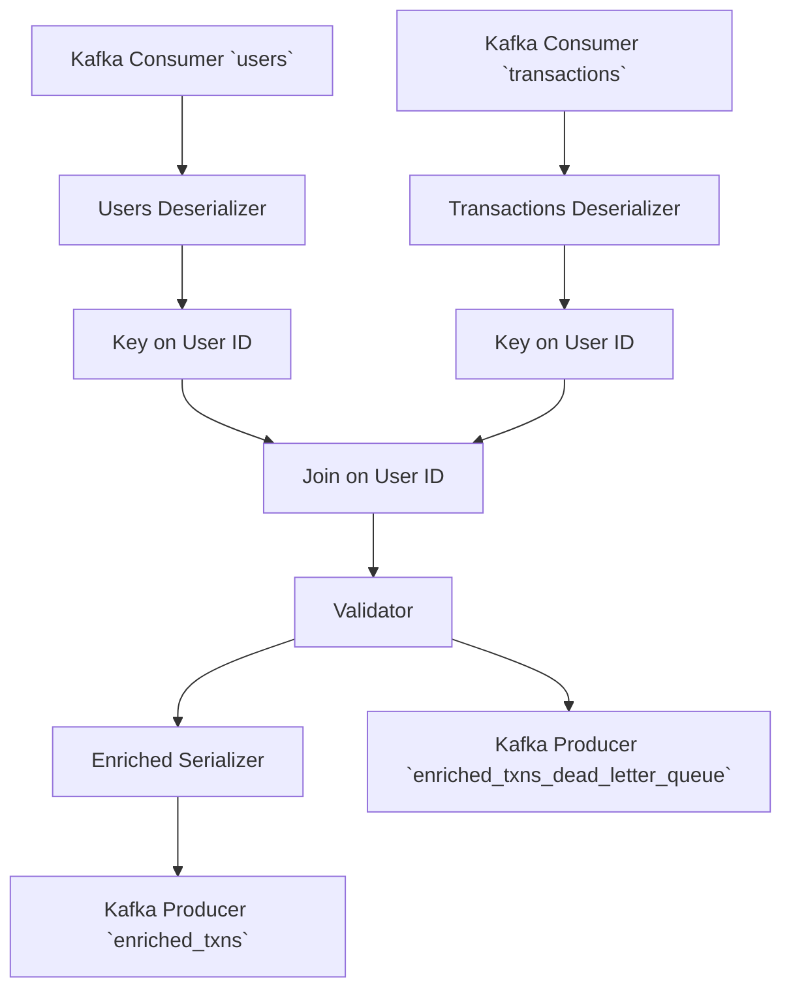

# Documentation Formatting

API documentation is Markdown files in the `/apidocs` folder. It is
built using [Sphinx](https://www.sphinx-doc.org/en/master/) and
[MyST](https://myst-parser.readthedocs.io/en/latest/index.html) for
Markdown parsing.

## Adding Articles

Articles for the user guide live in `/docs/articles` and
sub-directories within. You can add new Markdown files to add a new
article, but they must be added to a [Sphinx table of
contents](https://www.sphinx-doc.org/en/master/usage/restructuredtext/directives.html#toctree-directive)
to know where to add them in the document hierarchy. (Sphinx does not
require the directory structure to match the document structure.)

The TOC for the user guide is in `/docs/articles/index.md`. You can
add a new line with the path of that file the appropriate sub-section.

## MyST Cheat Sheet

Here's a quick rundown of common things in MyST flavored Markdown.

### Docstrings

Docstrings can be written using the all the features of MyST. Some
docstring-specific hints will be provided here.

#### Arguments

Docstrings should use MyST Markdown as the text body. Arguments,
return values, etc. specified using [MyST field
lists](inv:myst#syntax/fieldlists) which are `:name value:
Description` lines. The field names should be the same as the
[Sphinx](inv:sphinx#info-field-lists).

```python
def my_func(x: int, y: str) -> str:
    """Do the cool thing.

    :arg x: Describe the X parameter.

    :arg y: Describe the Y parameter. If this is a really long line,
        you can wrap it with indentation. You can also use any
        **syntax** here you like.

    :returns: A description of the return value.

    """
    ...
```

If the function signature is coming from PyO3 (and thus there are no
type hints in the code) you can use the `:type var:` and `:rtype:`
fields to provide argument and return value type hints.

```rust
/// Do the cool thing.
///
/// :arg x: Describe the X parameter.
///
/// :type x: int
///
/// :arg y: Describe the Y parameter. If this is a really long line,
///     you can wrap it with indentation. You can also use any
///     **syntax** here you like.
///
/// :type y: str
///
/// :returns: A description of the return value.
///
/// :rtype: str
#[pyfunction]
fn my_func(x: usize, y: String) -> String {
    todo!();
}
```

#### Class and Module Variables

You can add "post-variable docstrings" to document these.

```python
from dataclasses import dataclass
from typing import TypeVar


X = TypeVar("X")
"""Type of a cool thing."""


@dataclass
class Container:
    x: int
    """This is the docstring for this attribute."""

    y: str
    """This is the docstring for this other attribute."""
```

### Cross References

See [MyST's documentation on cross
referencing](inv:myst#syntax/cross-referencing) for all the ways this
can work. I'll give a quick summary here.

#### Other Markdown Files

To link to an entire article you can use normal Markdown link syntax
with a path to the Markdown file. The path can be relative or
absolute; if absolute it is rooted in `/docs`.

```markdown
Read the [article on recovery](/articles/concepts/recovery.md).
```

Appears as:

> Read the [article on recovery](/articles/concepts/recovery.md).

You can also automatically generate link text by using the Markdown
autolink syntax with the scheme `project:` and a path.

```markdown
Read about <project:/articles/concepts/recovery.md>
```

Appears as:

> Read about <project:/articles/concepts/recovery.md>

(xref-specific-section)=
#### A Specific Section

The system does not automatically generate xref links for headings.
You can manually add a reference name to any heading via the
`(ref-name)=` syntax just before it. In general, just add refs for
sections you know you want to reference elsewhere.

```markdown
(xref-specific-section)=
### A Specific Section
```

You can then reference it via normal Markdown link syntax with the URI
being just `#ref-name`.

```markdown
Read [how to link to a specific section](#xref-specific-section)
```

Appears as:

> Read [how to link to a specific section](#xref-specific-section)

Or the autolink syntax with the scheme `project:` and then a
`#ref-name`.

```markdown
Read about linking to <project:#xref-specific-section>
```

Appears as:

> Read about linking to <project:#xref-specific-section>

:::{note}

Either the link URI has to either start with a `#` and be a global
Sphinx reference, or it is a path. You can't mix and match. This will
not work.

```markdown
Read [how to link to a specific section](/articles/contributing/writing-docs.md#xref-specific-section)
```

Instead make an explicit reference target with `(ref-name)=`.

:::

#### API Docs

To link to a symbol in the Bytewax library, use the full dotted path
to it surrounded by `` ` `` and proceeded by `{py:obj}`.

```markdown
This operator returns a {py:obj}`bytewax.dataflow.Stream`.
```

Appears as:

> This operator returns a {py:obj}`bytewax.dataflow.Stream`.

You should always use the full dotted path to reference a name, but if
you don't want it to appear as a full dotted path because of the
context of the surrounding text, prefix the path with `~`.

```markdown
This operator returns a {py:obj}`~bytewax.dataflow.Stream`.
```

Appears as:

> This operator returns a {py:obj}`~bytewax.dataflow.Stream`.

#### Intersphinx

[Intersphinx](https://www.sphinx-doc.org/en/master/usage/extensions/intersphinx.html)
is the system for Sphinx to connect different documentation systems
together. The Sphinx config is already configured to have a few of our
dependencies including the Python standard library connected.

##### API Docs

For most external Python types, you can use the same xref syntax as
within Bytewax:

```markdown
See the standard library function {py:obj}`functools.reduce`.
```

Appears as:

> See the standard library function {py:obj}`functools.reduce`.

##### Other References

Other references use a more explicit system. You use URIs starting
with `inv:`, then the name of the inventory in the `/docs/conf.py`
`intersphinx_mapping`, then the domain, then the item name.

```markdown
Learn about [how to use lambdas](inv:python:std:label#tut-lambda).
```

Appears as:

> Learn about [how to use lambdas](inv:python:std:label#tut-lambda).

##### Finding Reference Names

If you don't know the exact xref incantation, you can use the included
dump tool to fuzzy search with `grep` or
[`fzf`](https://github.com/junegunn/fzf) over all the xrefs to find
the one you want.

```console
$ PIPENV_IGNORE_VIRTUALENVS=1 pipenv run python ./intersphinxdump.py | fzf
```

### Example Code

Use backtick code blocks with the `python` language type.

````markdown
```python
from bytewax.dataflow import Dataflow

flow = Dataflow("doc_df")
```
````

Appears as:

% cbfmt does not parse Markdown correctly and so this can't be quoted
% with `>`. It'll not strip those out and pass them to the formatter.

```python
from bytewax.dataflow import Dataflow

flow = Dataflow("doc_df")
```

### Shell Sessions

Use the language type `console` (instead of `bash`), and start
commands you run with `$` to get proper highlighting.

````markdown
```console
$ waxctl list
output here
```
````

Appears as:

> ```console
> $ waxctl list
> output here
> ```

### Mermaid Diagrams

We have install the Sphinx
[`sphinxcontrib-mermaid`](https://sphinxcontrib-mermaid-demo.readthedocs.io/en/latest/)
plugin which allows you to use `mermaid` as a code block language
name.

````markdown

````

Appears as:


## Doctests

`pytest` is setup to use
[Sybil](https://sybil.readthedocs.io/en/latest/index.html) to attempt
to run all Python code blocks in our documentation. This is so we
catch documentation we forget to update as we advance the API.

Running `pytest` will run over all:

- All documentation examples in Markdown files in `/docs`.

- All examples in docstrings in `/pysrc`.

- Docstrings from PyO3 are tested via the stubs file in
  `/pysrc/bytewax/_bytewax.pyi`. You must rebuild stubs to test these.

### Plain Code Blocks

If you have a plain Python code block, the code will be run to ensure
no exceptions, but no output will be checked.

````markdown
```python
x = 1 + 1
```
````

Appears as:

```python
x = 1 + 1
```

### Doctest Code Blocks

If you want to test the output, make it a doctest-style code block,
prefixing each line with `>>>` if it is input and output on the
following lines.

````markdown
```{doctest}
>>> 1 + 1
2
```
````

Appears as:

```{doctest}
>>> 1 + 1
2
```

### Test Code Blocks

:::{note}

Sybil doesn't fully support this yet, but I'm going to write it here
for when it does. We should still write these style of examples, but
they will not be automatically tested.

:::

If you'd like to have some commentary between the example code an the
output, use the `testcode` and `testoutput` directives. The `testcode`
block will automatically be highlighted as Python code.

````markdown
Here's some pre-commentary.

```{testcode}
1 + 1
```

Here's some middle-commentary.

```{testoutput}
2
```

Here's some post-commentary.
````

Appears as:

> Here's some pre-commentary.
>
> ```{testcode}
> 1 + 1
> ```
>
> Here's some middle-commentary.
>
> ```{testoutput}
> 2
> ```
>
> Here's some post-commentary.

### Skipping

To skip a doctest, use a Sybil skip comment. Add a line with `% skip:
next` right above the code block. The entire code block will not be
run.

````markdown
% skip: next

```python
invalid code
```
````

## Build Process

API reference documentation is automatically during the Sphinx build
process via the [`sphinx-autodoc2`
extension](https://sphinx-autodoc2.readthedocs.io/en/latest/index.html)
generated from our Python source in `/pysrc`. The build process turns
the source into automatically generated Markdown files in
`/apidocs/api`, which are then passed through the Sphinx builder.

The built HTML files are put in `/apidocs/html`. This is what should
be served.

### Pipenv

I have setup [`pipenv`](https://pipenv.pypa.io/en/latest/) as the way
to manage the blessed environment for building documentation because
it supports creating reproducible environments. It lets you pin a
specific version of the Python interpreter and all packages. These are
saved via `/apidocs/Pipfile` and `/apidocs/Pipfile.lock`.

You should install the latest version of `pipenv` globally and it will
use the lockfile in the current directory. It won't affect any other
Python environment tooling.

```console
$ pip install pipenv
```

`pipenv` will automatically use
[`pyenv`](https://github.com/pyenv/pyenv) to install the correct
version of the Python interpreter to make things consistent.

You should use the two build scripts below which automatically setup
`pipenv` for you.

### Auto Builder

The quickest way to iterate on your docs is to run the
`./autobuild.sh` script from the `/apidocs` directory.

```console
$ cd apidocs
$ ./autobuild.sh
Creating a virtualenv for this project...
...
All dependencies are now up-to-date!
...
Running Sphinx v7.2.6
...
[I 240124 12:03:11 server:335] Serving on http://127.0.0.1:8000
```

This starts a web server on <http://localhost:8000/> with the built
docs and will watch the source files and rebuild on any change.

### Committing Changes

Before a release, the updated docs should be committed into the repo.
Use the `./build.sh` script run from the `/apidocs` directory.

```console
$ cd apidocs
$ ./build.sh
```

Then commit the updated `/apidocs/html` directory.

```console
$ git add html
$ git commit
```
