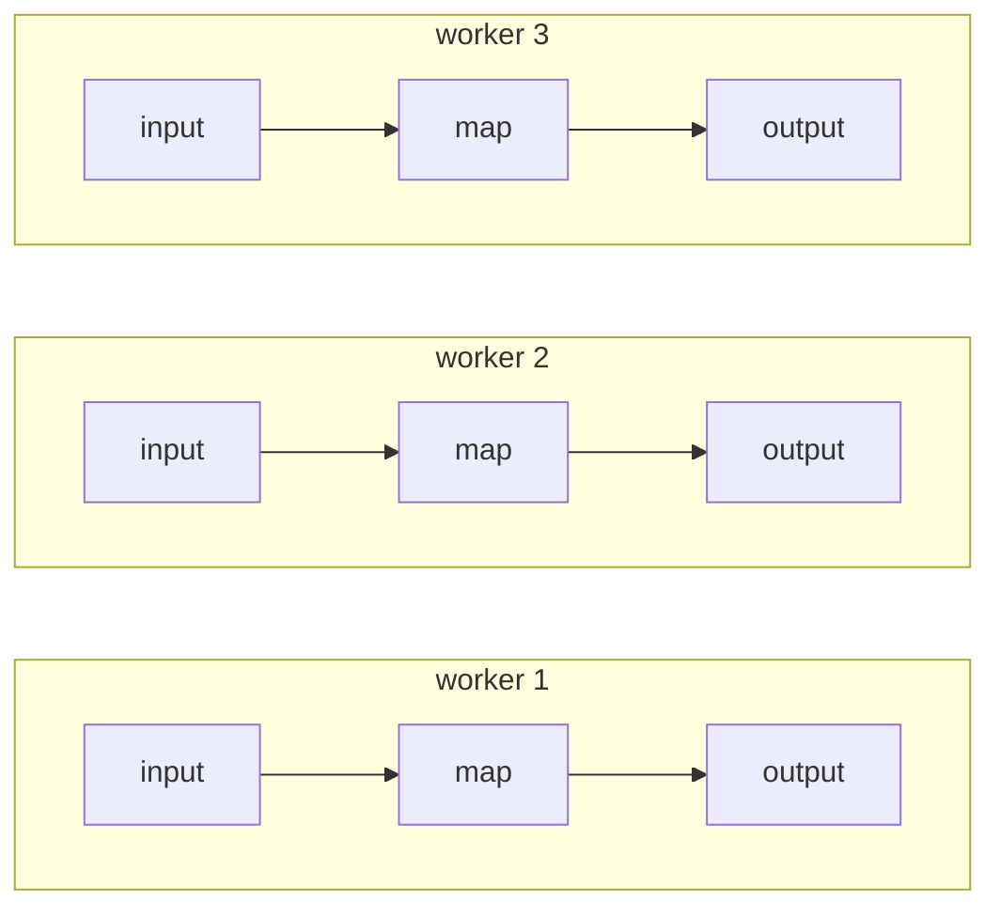
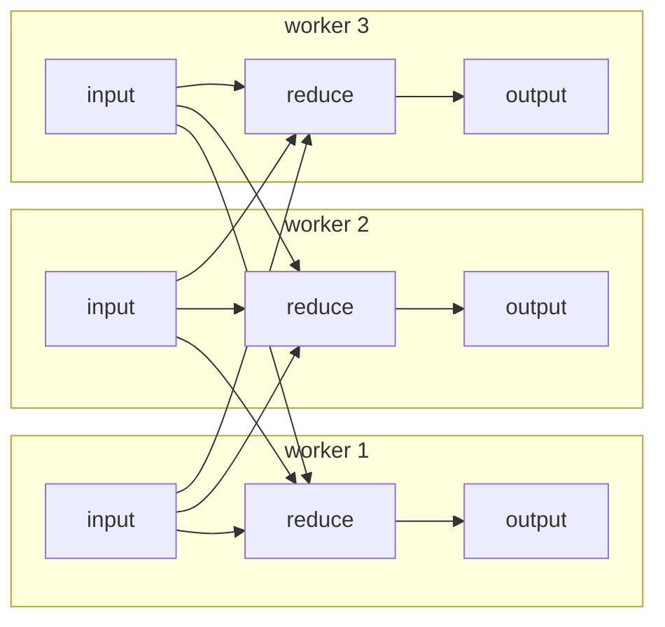
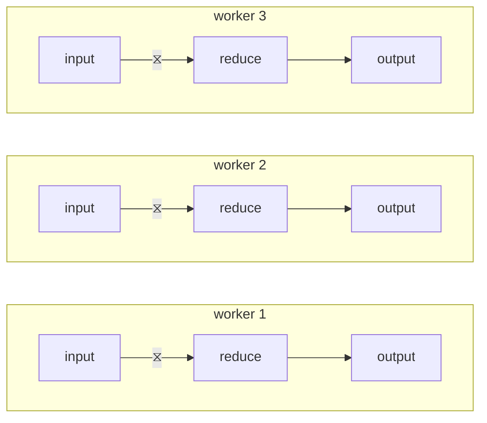
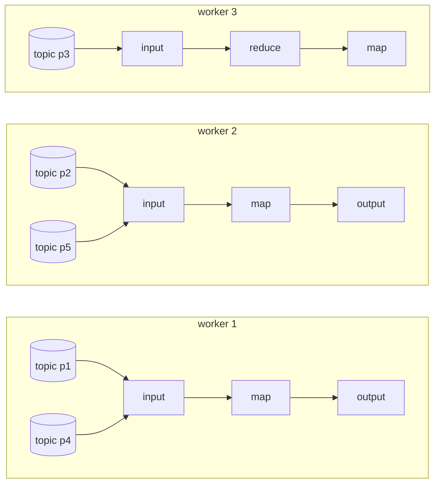
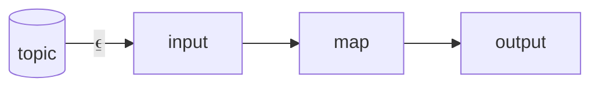
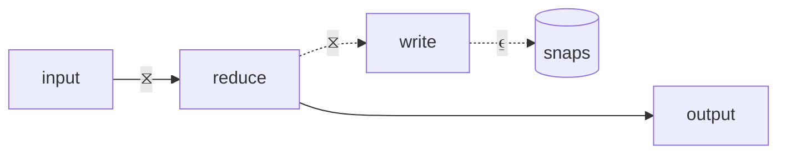
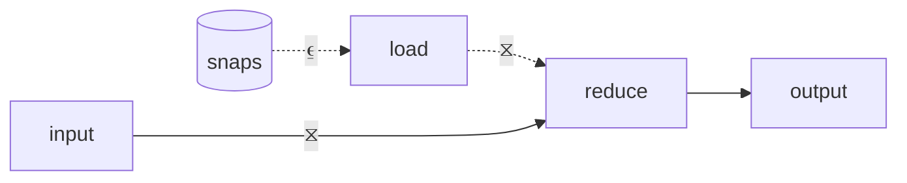
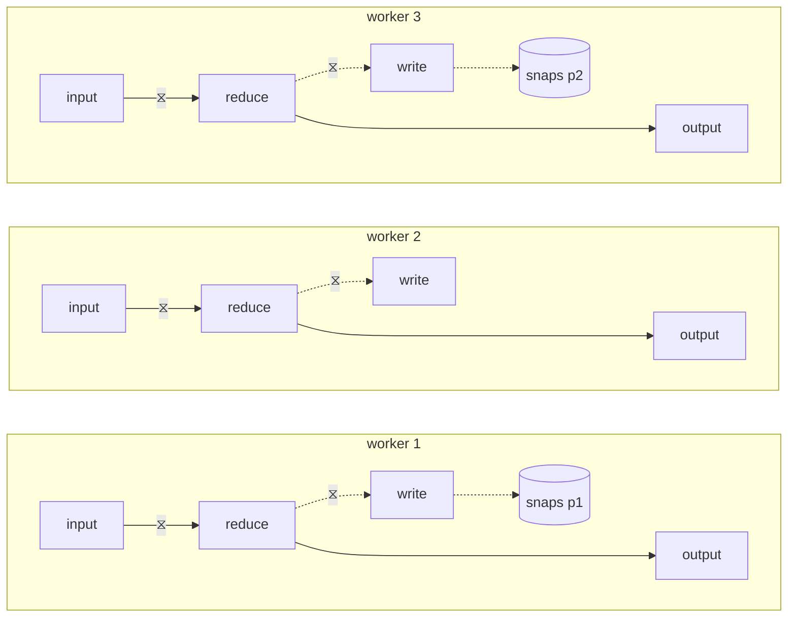
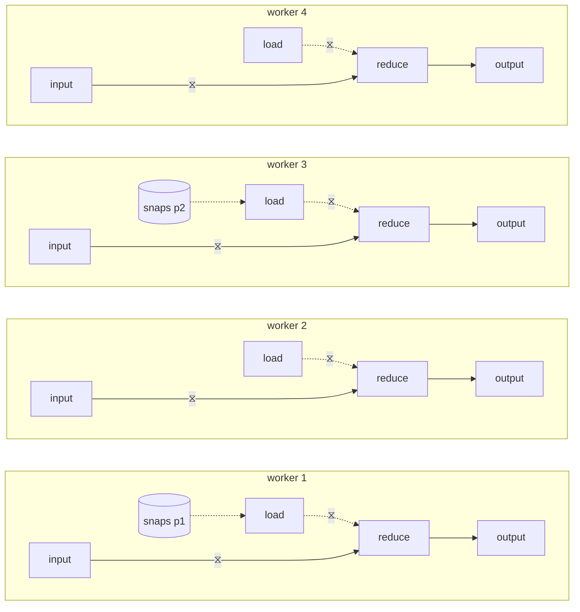

In this article, we're going to do a deep-dive into Bytewax's
rescaling functionality. **Rescaling** is the process by which you can
change the number of workers contributing computational resources to
your dataflow. Bytewax currently supports **stop-start rescaling**
where the rescaling operation happens as part of resuming a dataflow.

If your dataflow ends up needing more or less CPU or memory or network
bandwidth than originally provisioned, rescaling and recovery allow
you to right-size your dataflow cluster without needing to re-process
all data.

The core challenge to implementing rescaling is re-distributing state
across workers. To build up to that, let's start with a quick overview
of how Bytewax manages state and recovery data in an executing
dataflow.

## State Locations

Bytewax is built atop [Timely
Dataflow](https://github.com/TimelyDataflow/timely-dataflow), a
distributed dataflow execution engine written in
[Rust](https://www.rust-lang.org/). Thus, it inherits Timely's base
execution model: a set of _identical workers_ that each contribute to
running all dataflow operators.

Here's a diagram of an example dataflow with a stateless input reading
data, transforming it via a single (stateless) map step, and writing
it out to a stateless output.

State with each stateful operator (for example, reduce) is partitioned
by a **state key**, with a single worker being assigned the **primary
worker** for each key, and all incoming items for that key **routed**
to the primary worker. (This is why all stateful Bytewax operators
take `(key, value)` 2-tuples as their input upstream.) Having a single
primary worker allows state changes within a key to be a localized /
non-distributed problem.

This routing means that items might need to be serialized and
**exchanged** to a different worker before processing.

Here's a diagram of an example dataflow with a stateless input reading
data, transforming it via a single stateful reduce step, and writing
it out to a stateless output.

To simplify our dataflow diagrams, labeling a dataflow edge with ⧖
means items flowing on this edge will be moved to the relevant worker.

The previous dataflow diagram is thus equivalent to the following:

## Partitioned Primary Assignment

For non-IO stateful operators where the state needs no special
environment, primary workers are assigned by hashing the state key,
and so any worker in a given cluster could be primary for the key.

For partitioned input and output operators, partitions might _not_ be
globally accessible from all workers (e.g. each worker runs on
separate machine and has access to a distinct CSV file for input), so
primary workers are assigned: all workers initially broadcast what
partitions they have access to, the first worker of the cluster looks
at all of the access reports, the first worker uses an algorithm to
decide which worker with access to a partition is primary, then it
broadcasts the primary assignments to all workers. The primary workers
for each partition will then open the partition for reading and
writing, and in the output case, will be marked as the routing
destination for items to be written to that partition.

For example, if we had a dataflow that was reading from a Kafka topic
with five partitions, the resulting dataflow input components could
look like:

To simplify our dataflow diagrams, labeling a dataflow edge with ⍷
means that the partitions of the input or output source are
distributed among workers with access to that partition.

The previous dataflow diagram is thus equivalent to the following:

In every case, the important thing to remember is that only a single
worker manages state for a key.

## Snapshot Running State

Dataflow recovery is the process of quickly resuming the output of a
stateful dataflow from an interruption without needing to re-process
all input data. While running a dataflow, Bytewax periodically
**snapshots** all state and writes these snapshots to a fixed set of
sharded [SQLite](https://sqlite.org/index.html) databases called
**recovery partitions** on durable storage. Recovery partitions
outlive any specific dataflow execution cluster, a fixed number of
them are created before the dataflow is executed for the first time.

The snapshot output behaves similar to a normal partitioned output of
the dataflow: a worker is elected the primary for each recovery
partition and snapshot data is routed to the worker that manages the
writes for the relevant key on the snapshot data.

## Resuming is Rescaling

When resuming a dataflow, the snapshot data is loaded before any of
the input data in order to restore all stateful step's state. The
snapshot input behaves similar to a normal partitioned input of the
dataflow: a worker is elected the primary reader for each recovery
partition and starts reading that partition's snapshots.

Each stateful operator has a second **snapshot input** which takes in
these loaded snapshots on resume. These snapshots are routed using the
same mapping as the upstream items into the operator, and this is the
trick that enables start-stop rescaling: both resume state and items
are routed to the worker in the new cluster that will be handling that
state key. This does not need to be the same worker as in the previous
execution.

As an explicitly worked out example without the ⍷ shorthand, if we had
a dataflow execution of three workers, periodically writing out state
snapshots to two recovery partitions:

Then we stop that execution and start a new one with four workers but
the same two recovery partitions, the workers will collaborate on
reading the snapshots and routing them to the new workers that need to
manage that state:

## Conclusion

The combination of three features enables start-stop rescaling in
Bytewax:

1. State snapshots are routed in a consistent way to a fixed number of
   recovery partitions, regardless of cluster size.

2. The primary assignment system that allow distributed reading and
   writing of recovery partitions.

3. Loaded snapshots and incoming data are routed using the same keys
   so state is re-distributed across a new execution cluster
   correctly.

Hopefully, rescaling will be a useful tool for ensuring your dataflows
have a long and productive life in production.
