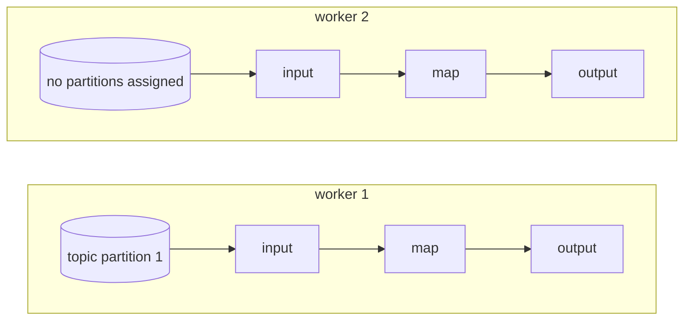
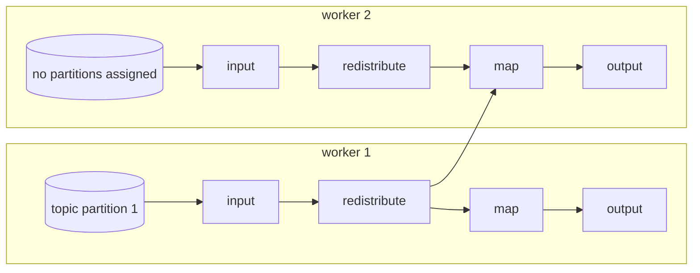

(xref-performance)=
# Performance

In this section, we will cover some of the important considerations when tuning
your Bytewax dataflow for performance.

Performance is a tricky subject to cover generally, as the goals for performance can
vary across different use cases. As an example, some use-cases may prioritize latency,
at the cost of overall throughput. In this guide, we will use the word performance to
represent a desired goal, whether that goal is throughput or latency.

As with all performance tuning, it is important to have good tooling to measure the
effect of any changes you make. See the section on <project:#xref-profiling>
for some tips on how to profile Bytewax.

One of the worthwhile trade-offs of dataflow programming is having to play
by the strict rules of operators and state management. In return you gain
the ability to more-easily scale your dataflow across a cluster for increased
performance. Unfortunately "more-easily" does not mean "trivially": Practically
speaking, only adding more workers to a dataflow does not automatically result
in an improvement in performance. The reality of all performance optimization
is matching computational resources to the specific needs of your computation,
and in this document we'll describe concrete design recommendations you should
follow while implementing your dataflow to play to the strengths of Bytewax and
ensure your dataflow is performant.

## Bytewax's worker execution model

A Bytewax **worker** is a thread that is executing your dataflow. Workers can be grouped
into separate processes, but refer to a single thread within a single process.

Bytewax's execution model uses identical workers. All workers contribute to executing
all steps in the dataflow graph. Workers **may** exchange data to ensure the
semantics of operators, but do not automatically exchange work to other workers
in order to increase performance.

## Workers, processes and GIL contention

When multiple workers are started within the same Python process using
`-w/--workers-per-process`, they must contend over Python's GIL, or
{external+python:std:term}`global interpreter lock`. Python's GIL ensures
that only one Python thread can run at a time, preventing race conditions and
ensuring thread-safety.

In practice this means that when you are attempting to increase the parallelism
of a dataflow, you should try starting with multiple processes using the
`-i/--process-id`, `-a/--addresses` instead of multiple workers with `-w`.

If your code can make use of libraries that make progress without holding the GIL
(like python's urllib), adding workers to each process with `-w` may increase performance.

The downside of starting multiple processes is that data must be serialized and
sent over the network when it is exchanged to other workers, while a single
process with multiple threads can avoid that overhead but must contend over the
GIL. See the [warning](#serialization-warning) in this document for more details
on the overhead of serialization.

## Input sources

One of the first things to consider when tuning a dataflow is the availability of
input. Can your source be read in parallel? When starting multiple workers, can
each of those workers read from your data source and make progress independently?

As an example, consider a topic in Kafka.

Topics in Kafka are made up of partitions. Each partition can be written to and read from
independently. When multiple partitions are available for a topic, multiple consumers can
read from different partitions in parallel, potentially increasing performance.

If your Kafka topic has a single partition, Bytewax will assign that partition to be
read from a single worker in your dataflow. By default, Bytewax will not exchange
data from that worker to other workers, unless your dataflow includes operators
that would necessitate that exchange to ensure correct semantics.




In this hypothetical scenario- a Kafka topic with a single partition, and a
dataflow with no stateful operators, adding multiple workers would not increase
performance as only worker one has been assigned any partitions and thus worker
two sits idle. In this scenario, the {py:obj}`~bytewax.operators.redistribute`
operator can be added after the {py:obj}`~bytewax.operators.input` step to
exchange messages to other workers in the dataflow to enable the other workers
to contribute to the downstream operations.




:::{warning}
:name: serialization-warning

Exchanging data to other workers introduces the overhead of serialization and
network communication to move data between workers. If the computations in
following operators are "small", it's possible that this overhead introduces
more of a performance penalty than running the computations on the original
more-loaded worker would have. Always empirically benchmark your performance to
see if {py:obj}`~bytewax.operators.redistribute` actually helps performance in
your specific dataflow.

:::

## Key space distribution

Stateful operators, like {py:obj}`~bytewax.operators.stateful_map` take a
{py:obj}`~bytewax.operators.KeyedStream` as their input. In order to ensure
the correct semantics for a stateful operator, all of the values for that key
must be processed by the same worker. This means that the size of the key space
sets an upper bound on the parallelization that your dataflow can achieve.
One of your goals in designing your dataflow data model should be to have as
fine-grained of a key space as possible during computationally-heavy steps so
that your dataflow can take advantage of as much parallelism as you can add.

Another side-effect of the fact that stateful work is located by-key is that
"hot keys" might result in specific workers having higher load, slowing the
overall progress of the dataflow. Try to select your key space so that work is
distributed over as many keys as possible.

There is no need to keep the same key-partitioning scheme for the entire
dataflow. Use whatever key space makes sense for the next computational step
that ensure the above two guidelines. E.g. feel free to initially partition
your data by user ID to perform some computations, then re-partition by shopping
cart ID, then {py:obj}`~bytewax.operators.join` back together by user ID. The
{py:obj}`~bytewax.operators.key_on` operator can be used multiple times.

## Batch sizes in input sources

While the API for operators like {py:obj}`~bytewax.operators.map` appear to operate over a
single item at a time, Bytewax operators will often operate over and produce batches
of messages internally for performance reasons. Some input sources can be
configured to emit larger or smaller batches of input data, which can influence
performance; look for a `batch_size` parameter on the input source.

Returning to our Kafka example- the Kafka consumers that are configured in Bytewax
will prefetch batches of messages at a time from Kafka. By default, we attempt
to fetch up to 1000 messages at a time in a batch to be emitted into the dataflow.

Some dataflows may benefit from larger or smaller batch sizes, depending on any
requirements you may have for latency and throughput. Fetching smaller batches,
or even a single message at a time may decrease latency, while increasing batch
sizes may improve throughput.

`batch_size` is a configurable parameter when instantiating a
{py:obj}`~bytewax.connectors.kafka.KafkaSource`:

```python
from bytewax.connectors.kafka import KafkaSource, KafkaSink, KafkaSinkMessage
from bytewax import operators as op
from bytewax.dataflow import Dataflow

flow = Dataflow("example")
kinp = op.input(
    "kafka-in", flow, KafkaSource(["localhost:19092"], ["in-topic"], batch_size=5000)
)
```

# Batching large-overhead operations

Some dataflows can take advantage of larger input batch sizes by using
operators like {py:obj}`~bytewax.operators.flat_map_batch` instead of
{py:obj}`~bytewax.operators.map`.

If you are doing things like performing a computation using a GPU
or calling out to a network service that has a batch endpoint,
{py:obj}`~bytewax.operators.flat_map_batch` can minimize the relative
amount of overhead due to network or GPU setup by processing a batch of input at once.

## Blocking calls and {py:obj}`time.sleep`

Bytewax operators participate in a cooperative multitasking system and must yield
control periodically in order for other operators to make progress. It is important that
code in an operator does not block execution with calls to functions like {py:obj}`time.sleep`.

It is also important to consider the effect of code within an operator that may block
waiting for input, like calls over the network to a remote endpoint that may block.
