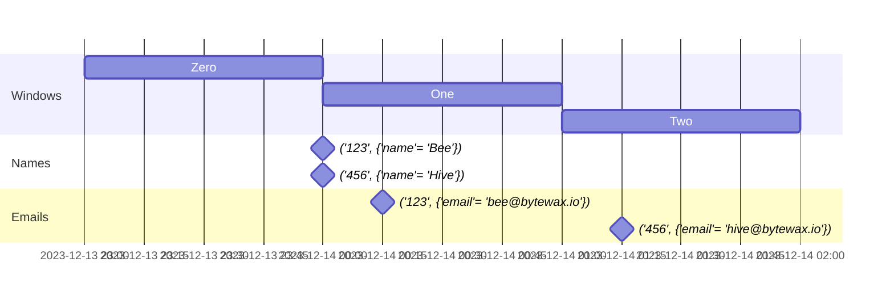

(xref-joins)=
# Joins

_Here we're going to give a deep dive on how joins work in Bytewax. If
you'd like a quick demo of "show me how to do a simple join", see
<project:#xref-join-eg>._

A **join** is a way to combine items in two or more streams into a
single stream, matching them by a **join key**.

This is a very similar concept to the joins available in SQL, but
there are some new edge cases and behaviors you have to be aware of
when handling unbounded streams of data.

For example, you might have a stream of user names:

```
{"user_id": 123, "name": "Bee"}
{"user_id": 456, "name": "Hive"}
```

And another stream of email addresses.

```
{"user_id": 123, "email": "bee@bytewax.io"}
{"user_id": 456, "email": "hive@bytewax.io"}
```

And you'd like to be able to have access to both simultaneously,
joined onto the same object:

```
{"user_id": 123, "name": "Bee", "email": "bee@bytewax.io"}
{"user_id": 456, "name": "Hive", "email": "hive@bytewax.io"}
```

Let's set up a sample dataflow that gets that data into some streams:

```{testcode}
from bytewax.dataflow import Dataflow
import bytewax.operators as op
from bytewax.testing import TestingSource

flow = Dataflow("join_eg")

names_l = [
    {"user_id": 123, "name": "Bee"},
    {"user_id": 456, "name": "Hive"},
]
names = op.input("names", flow, TestingSource(names_l))

emails_l = [
    {"user_id": 123, "email": "bee@bytewax.io"},
    {"user_id": 456, "email": "hive@bytewax.io"},
]
emails = op.input("emails", flow, TestingSource(emails_l))
```

Bytewax provides the {py:obj}`~bytewax.operators.join`,
{py:obj}`~bytewax.operators.windowing.join_window`, operators to
provide this functionality.

## Join Keys

All the join operators above are stateful operators and so require all
of the upstreams to contain 2-tuples with the first element being a
string called a **key**. A string is required so that the Bytewax
runtime has a standard type it can use to route data correctly. For
more information about state keys, see our <project:#xref-state-keys>.

If we wanted to join the data in the above streams, let's key it by
the `user_id` since that is what we want to bring the data together by.

Since `user_id` is an `int` in our input data, we need to pass it
through `str`. And since it'd be redundant to keep the `"user_id"` key
in the dict, we'll map the value to just include the relevant field.

```{testcode}
keyed_names = op.map("key_names", names, lambda x: (str(x["user_id"]), x["name"]))
keyed_emails = op.map("key_emails", emails, lambda x: (str(x["user_id"]), x["email"]))
```

Let's {py:obj}`~bytewax.operators.inspect` our streams to double check
we know what they look like:

```{testcode}
op.inspect("check_names", keyed_names)
op.inspect("check_emails", keyed_emails)
```

```{testcode}
:hide:

from bytewax.testing import run_main

run_main(flow)
```

Looks like we see our 2-tuples!

```{testoutput}
join_eg.check_names: ('123', 'Bee')
join_eg.check_emails: ('123', 'bee@bytewax.io')
join_eg.check_names: ('456', 'Hive')
join_eg.check_emails: ('456', 'hive@bytewax.io')
```

We took the input items, removed field names, and converted them to
`(key, value)` 2-tuples with a distinct string key to put them the
necessary format to do the join.

## Complete Joins

When doing a join in a SQL database, you look at the keys contained in
two tables and bring the other columns together. In a streaming
context, we have the concept of "key", we have the concept of "column"
(in the values for each key), but we don't have the exact concept of
"table". Each stream we call a **side** and is sort of like a table,
but for a SQL table there's an obvious end to the table; when you run
the join it takes the state of the table when you run the command.

In a streaming system, there is no guaranteed end to the stream, so
our joins have to have slightly different semantics. The default
behavior of the {py:obj}`~bytewax.operators.join` operator takes any
number of upstream sides and waits until we have seen a value for a
key on all sides of the join, and only then do we emit the gathered
values downstream as a {py:obj}`tuple` of the values in the same order
as the sides stream arguments. Bytewax calls this a **complete join**.
This is similar to an _inner join_ in SQL.

Let's see that in action. To recap our example:

```{testcode}
flow = Dataflow("join_eg")

names_l = [
    {"user_id": 123, "name": "Bee"},
    {"user_id": 456, "name": "Hive"},
]
names = op.input("names", flow, TestingSource(names_l))

emails_l = [
    {"user_id": 123, "email": "bee@bytewax.io"},
    {"user_id": 456, "email": "hive@bytewax.io"},
]
emails = op.input("emails", flow, TestingSource(emails_l))

keyed_names = op.map("key_names", names, lambda x: (str(x["user_id"]), x["name"]))
keyed_emails = op.map("key_emails", emails, lambda x: (str(x["user_id"]), x["email"]))
```

Then let's add a join operator taking the `keyed_names` stream as one
side and `keyed_emails` stream as the other and view the output:

```{testcode}
joined = op.join("join", keyed_names, keyed_emails)

op.inspect("check_join", joined)
```

```{testcode}
:hide:

run_main(flow)
```

Alright! It looks like we gathered the names and emails for each key.

```{testoutput}
join_eg.check_join: ('123', ('Bee', 'bee@bytewax.io'))
join_eg.check_join: ('456', ('Hive', 'hive@bytewax.io'))
```

## Missing Values

What happens if we don't have a value for a key? Let's update our
names input to add a name that won't have an email. Then run the
dataflow again.

```{testcode}
names_l.clear()
names_l.extend(
    [
        {"user_id": 123, "name": "Bee"},
        {"user_id": 456, "name": "Hive"},
        {"user_id": 789, "name": "Pooh Bear"},
    ]
)
```

```{testcode}
:hide:

run_main(flow)
```

Hmm. It seems we didn't get any output for Pooh.

```{testoutput}
join_eg.check_join: ('123', ('Bee', 'bee@bytewax.io'))
join_eg.check_join: ('456', ('Hive', 'hive@bytewax.io'))
```

This is because the inner join by default will wait forever until it
gets a value for all sides for a key. It has no idea how long it
should wait for Pooh's email to arrive, so it stays there.

Another ramification of this, is that if you see a second value on one
side for a key, you will also not see any output. For example, let's
update our input to have an email update for the Bee.

```{testcode}
names_l.clear()
names_l.extend(
    [
        {"user_id": 123, "name": "Bee"},
        {"user_id": 456, "name": "Hive"},
    ]
)

emails_l.clear()
emails_l.extend(
    [
        {"user_id": 123, "email": "bee@bytewax.io"},
        {"user_id": 456, "email": "hive@bytewax.io"},
        {"user_id": 123, "email": "queen@bytewax.io"},
    ]
)
```

```{testcode}
:hide:

run_main(flow)
```

Notice we still don't see any new output for that user.

```{testoutput}
join_eg.check_join: ('123', ('Bee', 'bee@bytewax.io'))
join_eg.check_join: ('456', ('Hive', 'hive@bytewax.io'))
```

For our complete join, by default, as soon as we see all the values
for a key, we _discard the join state_ and send it down stream. Thus
when the second "email" value comes in, there's no "name" value for
the key `"123"`, and the join operator waits until another value comes
in.

Let's visualize the state of the {py:obj}`~bytewax.operators.join`
operator evolving as it sees new items as a table. The table starts
empty.

| Key | Name Value | Email Value |
| --- | ---------- | ----------- |

Then it sees the first name value and emits nothing downstream.

| Key | Name Value | Email Value |
| --- | ---------- | ----------- |
| 123 | `"Bee"` | |

Then it sees the second name value and emits nothing downstream.

| Key | Name Value | Email Value |
| --- | ---------- | ----------- |
| 123 | `"Bee"` | |
| 456 | `"Hive"` | |

Then finally it sees the first email value.

| Key | Name Value | Email Value |
| --- | ---------- | ----------- |
| 123 | `"Bee"` | `"bee@bytewax.io"` |
| 456 | `"Hive"` | |

Right after this point, it gathers together each of the values, and
then clears that "row" in the "table" and the tuple is emitted
downstream.

| Key | Name Value | Email Value |
| --- | ---------- | ----------- |
| 456 | `"Hive"` | |

```
('123', ('Bee', 'bee@bytewax.io'))
```

Let's continue. We then see the second email come through and clear
that row.

| Key | Name Value | Email Value |
| --- | ---------- | ----------- |

```
('456', ('Hive', 'hive@bytewax.io'))
```

So note, now that the table is empty, when we see the email update for
the Bee, there's no name state. So nothing is emitted!

| Key | Name Value | Email Value |
| --- | ---------- | ----------- |
| 123 | | `"bee@bytewax.io"` |

Hopefully this helps clarify how basic streaming joins work. Realizing
that the {py:obj}`~bytewax.operators.join` operator only keeps the
state around while it is waiting for all sides to complete is the
trick to remember.

## Running Joins

Complete join semantics are useful in some cases, but on infinite data
you could imagine other join semantics. What Bytewax calls a **running
join** emits downstream the values for all sides of the join whenever
any value comes in, _and keeps the state around_. This is similar to a
_full outer join_ in SQL. Pass `emit_mode="running"` to
{py:obj}`~bytewax.operators.join` to enable a running join. By default
joins are complete, as described in the previous section, and not
running.

```{testcode}
:hide:

flow = Dataflow("join_eg")

names_l = [
    {"user_id": 123, "name": "Bee"},
    {"user_id": 456, "name": "Hive"},
]
names = op.input("names", flow, TestingSource(names_l))

emails_l = [
    {"user_id": 123, "email": "bee@bytewax.io"},
    {"user_id": 456, "email": "hive@bytewax.io"},
    {"user_id": 123, "email": "queen@bytewax.io"},
]
emails = op.input("emails", flow, TestingSource(emails_l))

keyed_names = op.map("key_names", names, lambda x: (str(x["user_id"]), x["name"]))
keyed_emails = op.map("key_emails", emails, lambda x: (str(x["user_id"]), x["email"]))
```

Now instead of the above join, let's use the running join:

```{testcode}
joined = op.join("join", keyed_names, keyed_emails, emit_mode="running")
```

Now let's run the dataflow again an inspect the output.

```{testcode}
op.inspect("check_join", joined)
```

```{testcode}
:hide:

run_main(flow)
```

Here's what we get. Let's visualize the progress and outputs of the
{py:obj}`~bytewax.operators.join` state table again but with
`emit_mode="running"`.

```{testoutput}
join_eg.check_join: ('123', ('Bee', None))
join_eg.check_join: ('123', ('Bee', 'bee@bytewax.io'))
join_eg.check_join: ('456', ('Hive', None))
join_eg.check_join: ('456', ('Hive', 'hive@bytewax.io'))
join_eg.check_join: ('123', ('Bee', 'queen@bytewax.io'))
```

First the table starts empty.

| Key | Name Value | Email Value |
| --- | ---------- | ----------- |

Then we see the first name value. Since the table was updated in any
way, it emits the current values for that key and keeps them in the
table! If it doesn't know a value yet, it fills it in as `None`.

| Key | Name Value | Email Value |
| --- | ---------- | ----------- |
| 123 | `"Bee"` | |

```
('123', ({'user_id': 123, 'name': 'Bee'}, None))
```

Then we see the second name value. The same thing happens

| Key | Name Value | Email Value |
| --- | ---------- | ----------- |
| 123 | `"Bee"` | |
| 456 | `"Hive"` | |

```
('456', ({'user_id': 456, 'name': 'Hive'}, None))
```

Now we see the first email value. The same rules apply, but now since
there are values for all the sides, we see them all in the output. The
state for that key is not cleared!

| Key | Name Value | Email Value |
| --- | ---------- | ----------- |
| 123 | `"Bee"` | `"bee@bytewax.io"` |
| 456 | `"Hive"` | |

```
('123', ('Bee', 'bee@bytewax.io'))
```

Then we see the second email value.

| Key | Name Value | Email Value |
| --- | ---------- | ----------- |
| 123 | `"Bee"` | `"bee@bytewax.io"` |
| 456 | `"Hive"` | `"hive@bytewax.io"` |

```
('456', ('Hive', 'hive@bytewax.io'))
```

Note that none of the state we have seen has been cleared. This now
means when we see the updated Bee email, we'll see some output!

| Key | Name Value | Email Value |
| --- | ---------- | ----------- |
| 123 | `"Bee"` | `"queen@bytewax.io"` |
| 456 | `"Hive"` | `"hive@bytewax.io"` |

```
('123', ('Bee', 'queen@bytewax.io'))
```

So the running join is cool in that you can track updates to changes
in values over time. There is also no concept of waiting for missing
values: all missing values are replaced with `None`. _But this comes
with a downside!_ Because we never throw away the state for a key,
this state keeps growing in memory _forever_ if you keep adding keys.
This might be the behavior you want, but realize that it does not come
for free. A complete join is better if you know you'll only get one
value for each side for each key, since it discards the state after
sending the values downstream.

## Windowed Joins

The streaming join assumes that a key could come anywhere in the
entire lifetime of a stream. This means it could possibly wait forever
for a value that will never arrive. Another option is to use a
**windowed join** that always flushes out the final values for a key
whenever the time-based window closes. Bytewax calls using the last
set of values within each window for each key a **final join**. You
can use this if you need to know the join values over an infinite
stream when you aren't sure that you'll see values on all sides of the
join.

Bytewax provides the operators
{py:obj}`~bytewax.operators.windowing.join_window` and to implement
this.

For the details of all the types of windows you can define and
explanation of the parameters, see <project:#xref-windowing>. We're
going to use a simple 1 hour tumbling window; the previous window
closes and the next window starts at the top of each hour. We'll be
using event time.

```{testcode}
from datetime import timedelta, datetime, timezone
from bytewax.operators.windowing import EventClock, TumblingWindower

clock = EventClock(ts_getter=lambda x: x["at"], wait_for_system_duration=timedelta(0))
windower = TumblingWindower(
    length=timedelta(hours=1),
    align_to=datetime(2023, 1, 1, 0, 0, 0, tzinfo=timezone.utc),
)
```

Let's assume we have input sources that are similar in shape to
before, but now have timestamps.

```{testcode}
flow = Dataflow("join_eg")

names_l = [
    {
        "user_id": 123,
        "at": datetime(2023, 12, 14, 0, 0, tzinfo=timezone.utc),
        "name": "Bee",
    },
    {
        "user_id": 456,
        "at": datetime(2023, 12, 14, 0, 0, tzinfo=timezone.utc),
        "name": "Hive",
    },
]
names = op.input("names", flow, TestingSource(names_l))

emails_l = [
    {
        "user_id": 123,
        "at": datetime(2023, 12, 14, 0, 15, tzinfo=timezone.utc),
        "email": "bee@bytewax.io",
    },
    {
        "user_id": 456,
        "at": datetime(2023, 12, 14, 1, 15, tzinfo=timezone.utc),
        "email": "hive@bytewax.io",
    },
]
emails = op.input("emails", flow, TestingSource(emails_l))
```

Since our objects are no longer just strings, let's keep the values
untouched so we have access to the timestamps.

```{testcode}
keyed_names = op.map("key_names", names, lambda x: (str(x["user_id"]), x))
keyed_emails = op.map("key_emails", emails, lambda x: (str(x["user_id"]), x))
```

Let's inspect this just to double check we understand the shape.

```{testcode}
op.inspect("check_names", keyed_names)
op.inspect("check_emails", keyed_emails)
```

```{testcode}
:hide:

run_main(flow)
```

The values are entire {py:obj}`dict`s and we'll still access the
`"at"` key to use the event timestamp.

```{testoutput}
join_eg.check_names: ('123', {'user_id': 123, 'at': datetime.datetime(2023, 12, 14, 0, 0, tzinfo=datetime.timezone.utc), 'name': 'Bee'})
join_eg.check_emails: ('123', {'user_id': 123, 'at': datetime.datetime(2023, 12, 14, 0, 15, tzinfo=datetime.timezone.utc), 'email': 'bee@bytewax.io'})
join_eg.check_names: ('456', {'user_id': 456, 'at': datetime.datetime(2023, 12, 14, 0, 0, tzinfo=datetime.timezone.utc), 'name': 'Hive'})
join_eg.check_emails: ('456', {'user_id': 456, 'at': datetime.datetime(2023, 12, 14, 1, 15, tzinfo=datetime.timezone.utc), 'email': 'hive@bytewax.io'})
```

Let's visualize what these windows and events look like on a timeline.
Window start times are inclusive, so something right on a window
border is in the next window.



So it looks like for key `"123"`, we should see the name and email be
joined because they occur in the same window. But for key `"456"` we
should see one downstream item of just the name (because no email came
for `"456"` in that window), and another downstream item of just the
email (because no name came in that window).

Now let's set up the windowed join and inspect the results to see if
it matches that. To review, the entire dataflow is as follows.

```{testcode}
import bytewax.operators.windowing as win

flow = Dataflow("join_eg")

names_l = [
    {
        "user_id": 123,
        "at": datetime(2023, 12, 14, 0, 0, tzinfo=timezone.utc),
        "name": "Bee",
    },
    {
        "user_id": 456,
        "at": datetime(2023, 12, 14, 0, 0, tzinfo=timezone.utc),
        "name": "Hive",
    },
]
names = op.input("names", flow, TestingSource(names_l))

emails_l = [
    {
        "user_id": 123,
        "at": datetime(2023, 12, 14, 0, 15, tzinfo=timezone.utc),
        "email": "bee@bytewax.io",
    },
    {
        "user_id": 456,
        "at": datetime(2023, 12, 14, 1, 15, tzinfo=timezone.utc),
        "email": "hive@bytewax.io",
    },
]
emails = op.input("emails", flow, TestingSource(emails_l))

keyed_names = op.map("key_names", names, lambda x: (str(x["user_id"]), x))
keyed_emails = op.map("key_emails", emails, lambda x: (str(x["user_id"]), x))

joined_out = win.join_window("join", clock, windower, keyed_names, keyed_emails)

op.inspect("check_join", joined_out.down)
```

```{testcode}
:hide:

run_main(flow)
```

Looks like that's what we see! Notice the `None` in the output for key
`"456"`. All window operators also emit the metadata about the window
for analysis, but you can ignore that.

```{testoutput}
join_eg.check_join: ('456', (8328, ({'user_id': 456, 'at': datetime.datetime(2023, 12, 14, 0, 0, tzinfo=datetime.timezone.utc), 'name': 'Hive'}, None)))
join_eg.check_join: ('123', (8328, ({'user_id': 123, 'at': datetime.datetime(2023, 12, 14, 0, 0, tzinfo=datetime.timezone.utc), 'name': 'Bee'}, {'user_id': 123, 'at': datetime.datetime(2023, 12, 14, 0, 15, tzinfo=datetime.timezone.utc), 'email': 'bee@bytewax.io'})))
join_eg.check_join: ('456', (8329, (None, {'user_id': 456, 'at': datetime.datetime(2023, 12, 14, 1, 15, tzinfo=datetime.timezone.utc), 'email': 'hive@bytewax.io'})))
```

You will have to decide in a downstream step how to handle these
`None` values. You might filter out joined items that contain any
`None` values so you can focus only on the running list of complete
updates, or fill in default values, etc.

## Product Joins

Bytewax has another windowing join mode called the **product join**.
It emits all of the combinations of _all_ of the input values seen on
a side during the window once the window closes.

For example, if we don't change the join parameters, but update the
input in the above dataflow to include multiple values in a window for
a key.

```{testcode}
names_l.clear()
names_l.extend(
    [
        {
            "user_id": 123,
            "at": datetime(2023, 12, 14, 0, 0, tzinfo=timezone.utc),
            "name": "Bee",
        },
    ]
)

emails_l.clear()
emails_l.extend(
    [
        {
            "user_id": 123,
            "at": datetime(2023, 12, 14, 0, 15, tzinfo=timezone.utc),
            "email": "bee@bytewax.io",
        },
        {
            "user_id": 123,
            "at": datetime(2023, 12, 14, 0, 30, tzinfo=timezone.utc),
            "email": "queen@bytewax.io",
        },
    ]
)
```

```{testcode}
:hide:

run_main(flow)
```

Notice how now we only have the latest email for the bee:

```{testoutput}
join_eg.check_join: ('123', (8328, ({'user_id': 123, 'at': datetime.datetime(2023, 12, 14, 0, 0, tzinfo=datetime.timezone.utc), 'name': 'Bee'}, {'user_id': 123, 'at': datetime.datetime(2023, 12, 14, 0, 30, tzinfo=datetime.timezone.utc), 'email': 'queen@bytewax.io'})))
```

Now if we re-define the dataflow and use `insert_mode="product"`, we
can see all of the values for the Bee's email in that window.

```{testcode}
:hide:

import bytewax.operators.windowing as win

flow = Dataflow("join_eg")

names = op.input("names", flow, TestingSource(names_l))
emails = op.input("emails", flow, TestingSource(emails_l))

keyed_names = op.map("key_names", names, lambda x: (str(x["user_id"]), x))
keyed_emails = op.map("key_emails", emails, lambda x: (str(x["user_id"]), x))
```

```{testcode}
joined_out = win.join_window(
    "join", clock, windower, keyed_names, keyed_emails, insert_mode="product"
)
```

```{testcode}
:hide:

op.inspect("check_join", joined_out.down)

run_main(flow)
```

Notice there are now two output values for that key.

```{testoutput}
join_eg.check_join: ('123', (8328, ({'user_id': 123, 'at': datetime.datetime(2023, 12, 14, 0, 0, tzinfo=datetime.timezone.utc), 'name': 'Bee'}, {'user_id': 123, 'at': datetime.datetime(2023, 12, 14, 0, 15, tzinfo=datetime.timezone.utc), 'email': 'bee@bytewax.io'})))
join_eg.check_join: ('123', (8328, ({'user_id': 123, 'at': datetime.datetime(2023, 12, 14, 0, 0, tzinfo=datetime.timezone.utc), 'name': 'Bee'}, {'user_id': 123, 'at': datetime.datetime(2023, 12, 14, 0, 30, tzinfo=datetime.timezone.utc), 'email': 'queen@bytewax.io'})))
```
