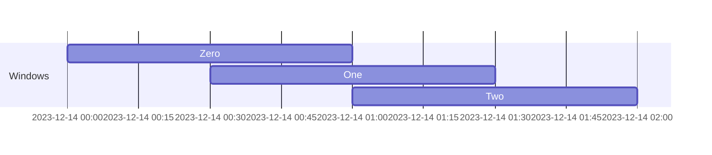
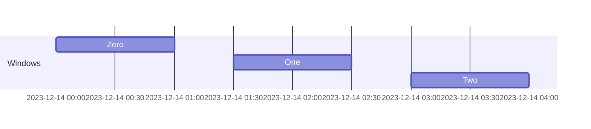
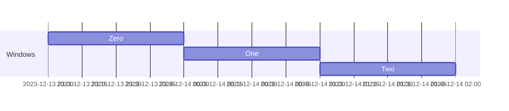
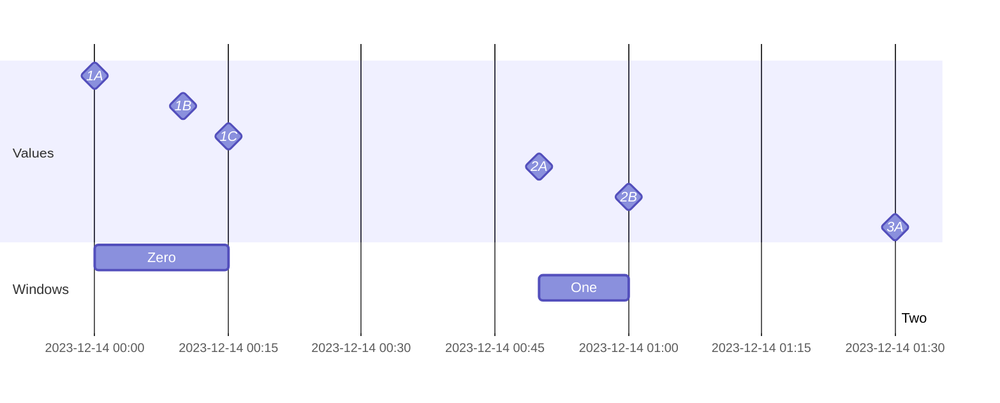

(xref-windowing)=
# Windowing

Bytewax provides some operators and pre-built configurations for
easily grouping data into buckets called **windows** and executing
operations on the data in the buckets via our **windowing operators**.

In order to define your window semantics, you have to chose two
related, but independent components: a clock and a windower. But first
lets discuss some of our windowing model.

## Watermarks and Late Data

Bytewax is a streaming system, thus is needs to support operating over
input data streams that might never end. Data might also arrive
out-of-order or late. You have to decide how long you are willing to
wait for out of order data before emitting the result of a calculation
from a windowing operator.

Bytewax uses the concept of watermarks to formalize this. The
**watermark** is the timestamp for which the system assumes that there
will be no more items in the stream with timestamps before this point,
and thus the system is free to calculate results and send them
downstream.

Values that arrive with timestamps before the current watermark are
considered **late** and are not assigned to any window.

:::{note}

Currently Bytewax logs and discards all late values. See
<project:#xref-metrics> for how to enable `TRACE` level logging, which
will show late data for debugging purposes.

:::

## Clocks

A **clock** defines the sense of time within the windowing operator. A
specific instance of a clock must be able to answer two questions:

1. What is the timestamp for a value?

2. What is the current watermark?

All clocks are an instance of
{py:obj}`~bytewax.windowing.Clock`. Let's discuss how each of
the built-in clocks answers these two questions.

### System Time

By instantiating a
{py:obj}`~bytewax.windowing.SystemClock` you can use system
time in your windowing definition.

1. The current system time is assigned to each value.

2. The watermark is always the current system time.

Because there can never be out-of-order or late data, all window
processing happens ASAP.

### Event Time

By instantiating a {py:obj}`~bytewax.windowing.EventClock` you
can use event time in your windowing definition. This is more nuanced.

1. The callback function
   {py:obj}`~bytewax.windowing.EventClock.ts_getter` is used
   to extract the timestamp within each value. If this timestamp is
   the largest ever seen, that and the current system time are stored
   internally. (System time never affects the timestamp assigned to an
   item when using the event clock.)

2. The watermark is the largest timestamp seen minus a buffer in which
   the system waits for out-of-order events. Even in the absence of
   incoming items, the watermark progresses forward as the waiting
   period for out-of-order items elapses and the system can close
   windows.

This definition of the watermark is a way to allow processing of
out-of-order data, but in a bounded way that supports both streaming
and batch replays. It assumes the model that you are processing data
that is being generated "physically": that timestamps generally come
in order and that a system can only introduce delays, and never
transport items into the future.

Let's analyze the streaming case where we are processing data in
real-time and waiting for new data to arrive. Let's say
`wait_for_system_duration = timedelta(minutes=5)`. In the following
table, we show the state of the clock as a few different values are
processed. The watermark is always advancing by the system time, the
watermark can be fast-forwarded if new timestamps are seen that show
that time has progressed, and items before the current watermark are
late. We will effectively wait for up to
{py:obj}`~bytewax.windowing.EventClock.wait_for_system_duration`
real-time for late data, then move on if we don't see any.

In the following tables:

- **System Time** - the current real clock time as a new item
  is received or if the watermark is being updated in isolation
  without a new item.

- **System Time of Max** - the system timestamp when we saw the item
  with the largest timestamp thus far.

- **Current Watermark** - the most recent fast-forwarded watermark
  plus the amount of system time since the item that caused the
  fast-forwarding.

- **Item Timestamp** - the timestamp on the incoming item.

- **Item Late** - if the item is before the current watermark.

- **Watermark Candidate** - the item's timestamp minus the
  `wait_for_system_duration` if the item wasn't late.

- **Accepted Watermark** - the new watermark if the candidate would
  push forward the watermark. If not, the watermark continues to
  progress due to system time.

In this example, first let's ingest an item with the timestamp
`10:35:00`. This results in setting the initial watermark.

| System Time | System Time of Max | Current Watermark | Item Timestamp | Item Late? | Watermark Candidate | Accepted Watermark? |
| ----------- | ------------------ | ----------------- | -------------- | ---------- | ------------------- | ------------------- |
| 10:32:00    | None               | None              | 10:35:00       | No         | 10:30:00            | 10:30:00            |

Then let's say a minute passes, and we want to check how the flow of
system time has affected the watermark. Because the watermark is
"physical" if a minute passes with no items, the watermark advances by
a minute from the accepted watermark above of `10:30:00` to
`10:31:00`.

| System Time | System Time of Max | Current Watermark | Item Timestamp | Item Late? | Watermark Candidate | Accepted Watermark? |
| ----------- | ------------------ | ----------------- | -------------- | ---------- | ------------------- | ------------------- |
| 10:33:00    | 10:32:00           | 10:31:00          |                |            |                     |                     |

Now a new item is encountered with a timestamp of `10:38:00`. Because
of slight fluctuations in this stream of events, it is "earlier" than
expected (just based on the first observed timestamp and how much
system time elapsed), but there's nothing unexpected about that as
perhaps there were ephemeral network or processing delays previously.
It ends up advancing the watermark because the candidate it creates is
later than the current watermark.

| System Time | System Time of Max | Current Watermark | Item Timestamp | Item Late? | Watermark Candidate | Accepted Watermark? |
| ----------- | ------------------ | ----------------- | -------------- | ---------- | ------------------- | ------------------- |
| 10:34:00    | 10:32:00           | 10:32:00          | 10:38:00       | No         | 10:33:00            | 10:33:00            |

Another new item is encountered, but this one is slightly "later" than
expected (again just based on if all items arrived exactly the system
time between their timestamps which is practically impossible). Since
accepting the candidate timestamp would result in the watermark going
backwards, it is rejected. The watermark continues to progress via
system time only.

| System Time | System Time of Max | Current Watermark | Item Timestamp | Item Late? | Watermark Candidate | Accepted Watermark? |
| ----------- | ------------------ | ----------------- | -------------- | ---------- | ------------------- | ------------------- |
| 10:36:00    | 10:34:00           | 10:35:00          | 10:39:00       | No         | 10:34:00            |                     |

Finally a new item comes in, but it's timestamp is so late it is
before the watermark. This causes it to be marked as late and
otherwise ignored in watermark calculations. Late events can be
processed in other ways, but that's completely outside the scope of
the windowing model.

| System Time | System Time of Max | Current Watermark | Item Timestamp | Item Late? | Watermark Candidate | Accepted Watermark? |
| ----------- | ------------------ | ----------------- | -------------- | ---------- | ------------------- | ------------------- |
| 10:38:00    | 10:34:00           | 10:37:00          | 10:36:00       | Yes        |                     |                     |

In the batch replay case, values will be being ingested much faster
than real-time, thus the watermark will almost never advance on its
own due to waiting, it will only be pushed forward by encountering
data with new timestamps. In this regime,
{py:obj}`~bytewax.windowing.EventClock.wait_for_system_duration` specifies
the maximum out-of-order-ness of the timestamps in the dataset. This
causes the system to identify late items in a similar way _as if the
data had been received in real-time_.

In the case of batch reading totally out-of-order data (e.g. reading a
CSV ordered by user ID but extracting a timestamp field), there is no
way to know a window has all values until the entire input has been
exhausted. In this case setting `wait_for_system_duration = `
{py:obj}`datetime.timedelta.max` does this.

## Windowers

Now that we have a definition of time due to the clock, we separately
pick a **windower** which defines how items are grouped together in
time. All clocks are an instance of
{py:obj}`~bytewax.windowing.Windower`.

Windows are **closed** once the watermark passes their close time.
This means no more data should arrive that could modify the window
state, so correct output can be emitted downstream.

### Sliding

**Sliding windows** are windows which have a fixed length, origin time
(the `align_to` argument), and spacing between starts of the windows.
Create them with {py:obj}`~bytewax.windowing.SlidingWindower`.

Windows must be aligned to a fixed and known origin time so that they
are consistent across failures and restarts.

This can result in overlapping windows. The following are 1 hour
windows with 30 minute offset, aligned to a specific midnight. Windows
are defined indefinitely in both directions in time, although they are
not pictured here.

Or gaps between windows, depending on the parameters. Values that fall
into these gaps will be dropped. The following are 1 hour windows with
1.5 hour offset aligned to a specific midnight.

### Tumbling

**Tumbling windows** are sliding windows where `offset == length` so
they are not overlapping and also contain no gaps. Create them with
{py:obj}`~bytewax.windowing.TumblingWindower`.

The following are 1 hour windows, aligned to a specific midnight.

### Session

**Session windows** are windows that are dynamically created whenever
there is a big enough gap in timestamps. Create them with
{py:obj}`~bytewax.windowing.SessionWindower`.

The following are the session windows resulting from these values with
a 30 minute gap.

## Operators

Now that we have a definition of time, a definition for which values
should be grouped together in a window, we now pick a **windowing
operator** which gives you patterns for how to combine the values in
each window to produce a result.

See the {py:obj}`bytewax.windowing` module for a list of our
windowing operators and their behavior.

All windowing operators emit `(key, (metadata, value))` nested tuples
downstream. The {py:obj}`~bytewax.windowing.WindowMetadata`
contains info about the window so you can do further processing. You
can also add a {py:obj}`~bytewax.operators.map` step to drop the data
if it is not needed.

All windowing operators are also stateful operators, so their input
must be `(key, value)` 2-tuples.

:::{important}

All state is partitioned by key. Thus currently Bytewax's windowing
model has independent clocks, windowers, and thus _watermarks_
per-key. Seeing a value with a timestamp will only update the
watermark _for the key of that value_. There is no per-stream or
per-partition watermark mode currently.

:::

Currently all windowing operators only emit data after a window is
closed.

## Recovery

Recovery happens on the granularity of snapshots, not windows. The
snapshot interval has no effect on windowing operator behavior when
there are no failures; it is solely an implementation detail of the
recovery system. (See <project:#xref-recovery> for more info) Failure
and recovery in the middle of a window will be handled as gracefully
as possible.

Some clocks don't have a single correct answer on what to do during
resume. E.g. if you use
{py:obj}`~bytewax.windowing.SystemClock` with 10 minute
windows, but then resume on a 15 minute mark, the system will
immediately close out the half-completed window started in the
previous execution when the next execution resumes.

:::{warning}

This means that using system time results in non-determinism over
resumes. Because resuming happens on snapshot boundaries, the window
that was assigned to a value in one execution just after a snapshot
will not be the window it is assigned to after resume.

If you need determinism for some reason (e.g. tests), use event time.

:::
