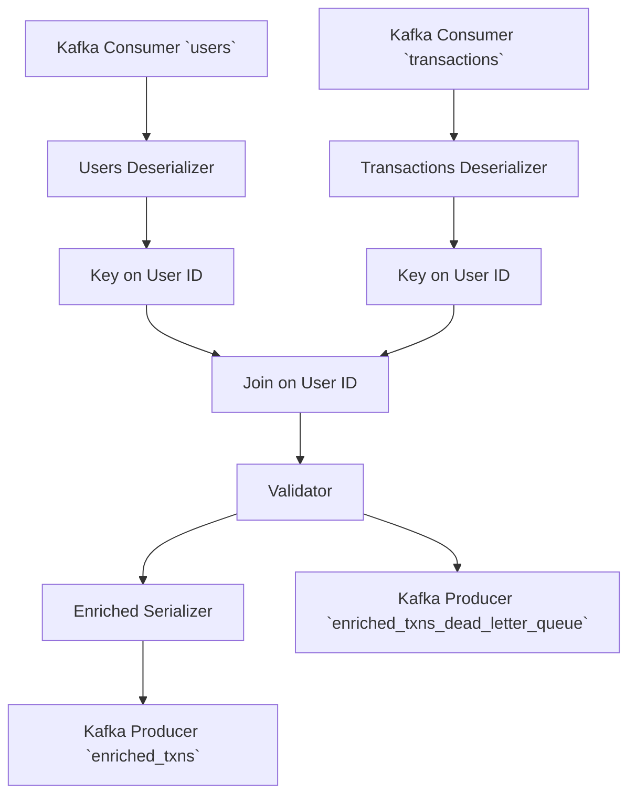

# Documentation Formatting

Documentation are Markdown files in the `/docs` folder. It is built
using [Sphinx](https://www.sphinx-doc.org/en/master/) and
[MyST](https://myst-parser.readthedocs.io/en/latest/index.html) for
Markdown parsing.

## Adding User Guides

Articles for the user guide live in `/docs/guide` and sub-directories
within. You can add new Markdown files to add a new article, but they
must be added to a [Sphinx table of
contents](https://www.sphinx-doc.org/en/master/usage/restructuredtext/directives.html#toctree-directive)
to know where to add them in the document hierarchy. (Sphinx does not
require the directory structure to match the document structure.)

The TOC for the user guide is in `/docs/guide/index.md`. You can add a
new line with the path of that file the appropriate sub-section.

## API Docs

API reference documentation is automatically during the Sphinx build
process via the [`sphinx-autodoc2`
extension](https://sphinx-autodoc2.readthedocs.io/en/latest/index.html)
generated from our Python source in `/pysrc`. The build process turns
the source into automatically generated Markdown files in `/docs/api`,
which are then passed through the Sphinx builder.

## Local Prototyping

You'll need to set up a local development environment. See
<project:#xref-dev-env> and specifically <project:#xref-dev-docs>.

## MyST Cheat Sheet

Here's a quick rundown of common things in MyST flavored Markdown.

### Docstrings

Docstrings can be written using the all the features of MyST. Some
docstring-specific hints will be provided here.

#### Arguments

Docstrings should use MyST Markdown as the text body. Arguments,
return values, etc. specified using [MyST field
lists](inv:myst#syntax/fieldlists) which are `:name value:
Description` lines. The field names should be the same as the
[Sphinx](inv:sphinx#info-field-lists).

```{testcode}
def my_func(x: int, y: str) -> str:
    """Do the cool thing.

    :arg x: Describe the X parameter.

    :arg y: Describe the Y parameter. If this is a really long line,
        you can wrap it with indentation. You can also use any
        **syntax** here you like.

    :returns: A description of the return value.

    """
    ...
```

If the function signature is coming from PyO3 (and thus there are no
type hints in the code) you can use the `:type var:` and `:rtype:`
fields to provide argument and return value type hints.

```rust
/// Do the cool thing.
///
/// :arg x: Describe the X parameter.
///
/// :type x: int
///
/// :arg y: Describe the Y parameter. If this is a really long line,
///     you can wrap it with indentation. You can also use any
///     **syntax** here you like.
///
/// :type y: str
///
/// :returns: A description of the return value.
///
/// :rtype: str
#[pyfunction]
fn my_func(x: usize, y: String) -> String {
    todo!();
}
```

#### Class and Module Variables

You can add "post-variable docstrings" to document these.

```{testcode}
from dataclasses import dataclass
from typing import TypeVar


X = TypeVar("X")
"""Type of a cool thing."""


@dataclass
class Container:
    x: int
    """This is the docstring for this attribute."""

    y: str
    """This is the docstring for this other attribute."""
```

### Cross References

See [MyST's documentation on cross
referencing](inv:myst#syntax/cross-referencing) for all the ways this
can work. I'll give a quick summary here.

(xref-specific-section)=
#### A Specific Section

The system does not automatically generate xref links for headings.
You can manually add a reference name to any heading via the
`(xref-name)=` syntax just before it. In general, just add refs for
sections you know you want to reference elsewhere.

```markdown
(xref-specific-section)=
### A Specific Section
```

You can then reference it via normal Markdown link syntax with the URI
being just `#xref-name`.

```markdown
Read [how to link to a specific section](#xref-specific-section)
```

Appears as:

> Read [how to link to a specific section](#xref-specific-section)

Or the autolink syntax with the scheme `project:` and then a
`#xref-name`.

```markdown
Read about linking to <project:#xref-specific-section>
```

Appears as:

> Read about linking to <project:#xref-specific-section>

:::{warning}

All of your reference names must start with `xref` by convention to
ensure that they are globally unique across all Sphinx domains.
Unfortunately, MyST's Markdown link xref resolver does not let you
specify Sphinx domains and tries to resolve everything using the `all`
directive, so it's possible that the name you pick would clash with
the name of a file (clashing with the `doc` domain) or a Python module
(clashing with the `py` domain) and you get multiple targets.
Prefixing them with `xref` means that we are less likely to clash.

Perhaps one day MyST will provide a syntax for unambiguously
specifying an xref when they fix [this
issue](https://github.com/executablebooks/MyST-Parser/issues/548).

:::

:::{note}

Either the link URI has to either start with a `#` and be a global
Sphinx reference, or it is a path. You can't mix and match. This will
not work.

```markdown
Read [how to link to a specific section](/guide/contributing/writing-docs.md#xref-specific-section)
```

Instead make an explicit reference target with `(xref-name)=`.

:::

#### Other Markdown Files

To link to an entire article, add an xref to the main header in the
file and link to that. Use the steps and syntax above.

#### API Docs

To link to a symbol in the Bytewax library, use the full dotted path
to it surrounded by `` ` `` and proceeded by `{py:obj}`.

```markdown
This operator returns a {py:obj}`bytewax.dataflow.Stream`.
```

Appears as:

> This operator returns a {py:obj}`bytewax.dataflow.Stream`.

You should always use the full dotted path to reference a name, but if
you don't want it to appear as a full dotted path because of the
context of the surrounding text, prefix the path with `~`.

```markdown
This operator returns a {py:obj}`~bytewax.dataflow.Stream`.
```

Appears as:

> This operator returns a {py:obj}`~bytewax.dataflow.Stream`.

#### Intersphinx

[Intersphinx](https://www.sphinx-doc.org/en/master/usage/extensions/intersphinx.html)
is the system for Sphinx to connect different documentation systems
together. The Sphinx config is already configured to have a few of our
dependencies including the Python standard library connected.

##### API Docs

For most external Python types, you can use the same xref syntax as
within Bytewax:

```markdown
See the standard library function {py:obj}`functools.reduce`.
```

Appears as:

> See the standard library function {py:obj}`functools.reduce`.

##### Other References

Other references use a more explicit system. You use URIs starting
with `inv:`, then the name of the inventory in the `/docs/conf.py`
`intersphinx_mapping`, then the domain, then the item name.

```markdown
Learn about [how to use lambdas](inv:python:std:label#tut-lambda).
```

Appears as:

> Learn about [how to use lambdas](inv:python:std:label#tut-lambda).

##### Finding Reference Names

If you don't know the exact xref incantation, you can use the included
dump tool to fuzzy search with `grep` or
[`fzf`](https://github.com/junegunn/fzf) over all the xrefs to find
the one you want.

```console
(dev) $ python ./intersphinxdump.py | fzf
```

### Example Python Code

Use backtick code blocks with the `{testcode}` language type. Use this
instead of `python` to ensure that the code block is run as a doctest.
It will still be syntax highlighted as if it was Python.

````markdown
```{testcode}
from bytewax.dataflow import Dataflow

flow = Dataflow("doc_df")
```
````

Appears as:

% cbfmt does not parse Markdown correctly and so this can't be quoted
% with `>`. It'll not strip those out and pass them to the formatter.

```{testcode}
from bytewax.dataflow import Dataflow

flow = Dataflow("doc_df")
```

If you are really sure that you don't want the code to run as part of
the doctest suite, you can use the `python` language instead.

### Shell Sessions

Use the language type `console` (instead of `bash`), and start
commands you run with `$` to get proper highlighting.

````markdown
```console
$ waxctl list
output here
```
````

Appears as:

> ```console
> $ waxctl list
> output here
> ```

### Mermaid Diagrams

We have install the Sphinx
[`sphinxcontrib-mermaid`](https://sphinxcontrib-mermaid-demo.readthedocs.io/en/latest/)
plugin which allows you to use `mermaid` as a code block language
name.

````markdown

````

Appears as:


## Doctests

We have a Sphinx builder which to run all Python code blocks in our
documentation. This is so we catch documentation we forget to update
as we advance the API.

Running `just test-doc` will run over all:

- All documentation examples in Markdown files in `/docs`.

- All examples in docstrings in `/pysrc` via the API docs pages.

- Docstrings from PyO3 are tested via the stubs file in
  `/pysrc/bytewax/_bytewax.pyi` and then via the API docs pages. You
  must rebuild stubs to test these.

For more options and details on this system, see
<inv:sphinx:py:module#sphinx.ext.doctest> in the Sphinx docs.

### Code Block with No Output

If you have a plain Python `{testcode}` block, the code will be run to
ensure no exceptions, but no output will be checked.

````markdown
```{testcode}
x = 1 + 1
```
````

Appears as:

```{testcode}
x = 1 + 1
```

### Code Block Checking Output

To assert some specific stdout from a code block, pair a
`{testoutput}` block after a `{testcode}` one.

````markdown
Here's some pre-commentary.

```{testcode}
print(1 + 1)
```

Here's some middle-commentary.

```{testoutput}
2
```

Here's some post-commentary.
````

Appears as:

> Here's some pre-commentary.
>
> ```{testcode}
> print(1 + 1)
> ```
>
> Here's some middle-commentary.
>
> ```{testoutput}
> 2
> ```
>
> Here's some post-commentary.

### Testing a Dataflow / Hidden Code

Sometimes to get these automated tests to run, you have to do setup to
satisfy the interpreter, but it would distract from the flow of the
documentation. In that case, you can hide `{testcode}` or
`{testoutput}` blocks and they will not appear in the rendered
documentation, but will still be tested. The power of this comes from
you don't have to hide both blocks of a pair.

This is commonly used to test the example output of a dataflow without
needing to show the run function (since a real user would use the run
script anyway).

````markdown
```{testcode}
:hide:

from bytewax.dataflow import Dataflow
from bytewax.testing import run_main, TestingSource
from bytewax.connectors.stdio import StdOutSink
import bytewax.operators as op
```

```{testcode}
flow = Dataflow("test_df")
nums = op.input("inp", flow, TestingSource([1, 2, 3]))
op.output("out", nums, StdOutSink())
```

```{testcode}
:hide:

run_main(flow)
```

```{testoutput}
1
2
3
```
````

Appears as:

```{testcode}
:hide:

from bytewax.dataflow import Dataflow
from bytewax.testing import run_main, TestingSource
from bytewax.connectors.stdio import StdOutSink
import bytewax.operators as op
```

```{testcode}
flow = Dataflow("test_df")
nums = op.input("inp", flow, TestingSource([1, 2, 3]))
op.output("out", nums, StdOutSink())
```

```{testcode}
:hide:

run_main(flow)
```

```{testoutput}
1
2
3
```

### Using Fixture Files

`just test-doc` cds into the `docs/fixtures/` directory before running
the test doc builder. This means you have access to all files within
that directory for any of the doctests.

E.g. in our wordcount example we use a fixture file.

```{testcode}
from bytewax.dataflow import Dataflow
from bytewax.connectors.files import FileSource

flow = Dataflow("wordcount_eg")
inp = op.input("inp", flow, FileSource("wordcount.txt"))
```

### Doctest Code Block

If you want to show an interactive interpreter session to show the
details of an example, make it a doctest-style code block, using the
`doctest` directive. You should prefix each line with `>>>` if it is
input and output on the following lines.

````markdown
```{doctest}
>>> 1 + 1
2
```
````

Appears as:

```{doctest}
>>> 1 + 1
2
```

### Skipping

To skip a whole code block, use the `python` / `text` language instead
of `{testcode}` / `{testoutput}`.

To skip a single line in a `{doctest}` block, you can use an inline
doctest option.

````markdown
```{doctest}
>>> datetime.date.now()   # doctest: +SKIP
datetime.date(2008, 1, 1)
```
````
