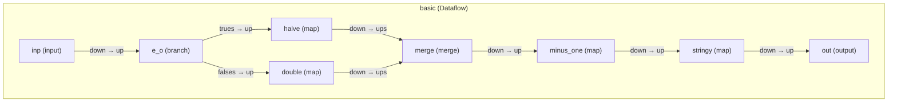

# Debugging

Tricks for solving problems in your dataflow.

## Inspecting

Bytewax provides the {py:obj}`~bytewax.operators.inspect` operator to
help you visualize what is going on inside your dataflow. It prints
out the repr of all items that pass through it when you run the
dataflow. You can attach it to any stream you'd like to see.

## Step Names and Step IDs

Operator methods take a string step name as their first argument which
should represent the semantic purpose of that computational step.

Bytewax operators are defined in terms of other operators
hierarchically in nested **substeps**. In order to disambiguate
information about substeps under a single top-level step, each substep
is assigned a unique **step ID**, which is a dotted path of all the
step names down the hierarchy to that individual operator.

This means exceptions, logs, traces, and metrics might show step IDs
like `branching_math.do_double.flat_map`. Don't fret! Read them from
left to right: the first component will be the flow ID, then the
top-level step name, then the path to the specific inner substep the
information applies to.

Just because an exception references a step ID of a substep of one of
your steps, does not mean the bug is in the inner step. It's possible
some logic function or value supplied is not conforming to the
contract the operator set. You'll need to read the exception and
documentation of the operator carefully.

## Visualizing Structure

The Bytewax library includes a small helper script to visualize
dataflow structure. This can help you build more complicated dataflows
easily. To use it run the {py:obj}`bytewax.visualize` module with the
dataflow import path (just like when ):

```console
$ python -m bytewax.visualize examples.basic
flowchart TD
subgraph "basic (Dataflow)"
basic.inp["inp (input)"]
basic.e_o["e_o (branch)"]
basic.inp -- "down → up" --> basic.e_o
basic.halve["halve (map)"]
basic.e_o -- "trues → up" --> basic.halve
basic.double["double (map)"]
basic.e_o -- "falses → up" --> basic.double
basic.merge["merge (merge)"]
basic.halve -- "down → ups" --> basic.merge
basic.double -- "down → ups" --> basic.merge
basic.minus_one["minus_one (map)"]
basic.merge -- "down → up" --> basic.minus_one
basic.stringy["stringy (map)"]
basic.minus_one -- "down → up" --> basic.stringy
basic.out["out (output)"]
basic.stringy -- "down → up" --> basic.out
end
```

By default, this outputs the code for a
[MermaidJS](https://mermaid.js.org/) diagram. There are various ways
to render the diagram, but using https://mermaid.live/ is one easy
way.

For example, the following dataflow.

```{testcode}
flow = Dataflow("basic")
inp = op.input("inp", flow, TestingSource(range(10)))
branch = op.branch("e_o", inp, lambda x: x % 2 == 0)
evens = op.map("halve", branch.trues, lambda x: x // 2)
odds = op.map("double", branch.falses, lambda x: x * 2)
combo = op.merge("merge", evens, odds)
combo = op.map("minus_one", combo, lambda x: x - 1)
string_output = op.map("stringy", combo, lambda x: f"<dance>x</dance>")
op.output("out", string_output, StdOutSink())

```

Renders as:


