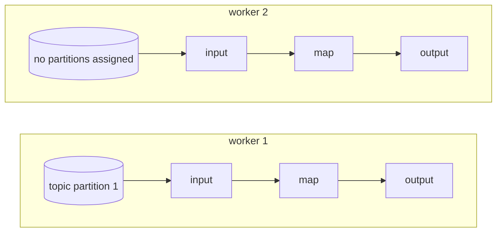
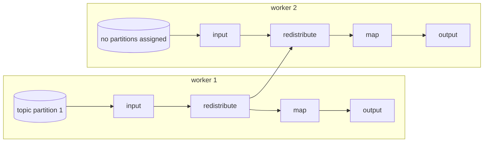

# Performance

In this section, we will cover some of the important considerations when tuning
your bytewax dataflow for performance.

Performance is a tricky subject to cover generally, as the goals for performance can
vary across different use cases. As an example, some use-cases may prioritize latency,
at the cost of overall throughput. In this guide, we will use the word performance to
represent a desired goal, whether that goal is throughput or latency.

As with all performance tuning, it is important to have good tooling to measure the
effect of any changes you make. See the section on [Profiling](project:#xref-profiling)
for some tips on how to profile Bytewax.

## Bytewax's worker execution model

A Bytewax **worker** is a thread that is executing your dataflow. Workers can be grouped
into separate processes, but refer to a single thread within a single process.

Bytewax's execution model uses identical workers. Workers execute all of the steps
in a dataflow, including input and output steps. Workers **may** exchange
data to ensure the semantics of operators, but do not automatically
exchange work to other workers in order to increase performance.

Practially speaking- adding more workers to a dataflow does not automatically
result in an improvement in performance.

## Input sources

One of the first things to consider when tuning a dataflow is the availability of
input. Can your source be read in parallel? When starting multiple workers, can
each of those workers read from your data source and make progress independently?

As an example, consider a topic in Kafka.

Topics in Kafka are made up of partitions. Each partition can be written to and read from
independently. When multiple partitions are available for a topic, multiple consumers can
read from different partitions in parallel, potentially increasing performance.

If your Kafka topic has a single partition, bytewax will assign that partition to be
read from a single worker in your dataflow. By default, Bytewax will not exchange
data from that worker to other workers, unless your dataflow includes operators
that would necessitate that exchange to ensure correct semantics.




In this hypothetical scenario- a Kafka topic with a single partition, and a dataflow
with no stateful operators, adding multiple workers would not increase performance as
data will not be processed by other workers. In this scenario, the
{py:obj}`~bytewax.operators.redistribute` operator can be used to exchange messages
to other workers in the dataflow.



:::{note}

It is important to note that exchanging data to other workers has an additional
overhead of serializing and deserializing data to safely move data between workers.

:::

## Key space distribution

Some operators, like {py:obj}`~bytewax.operators.stateful_map` take a
{py:obj}`~bytewax.operators.KeyedStream` as their input. In order to ensure
the correct semantics for an operator, all of the values for that key must
be processed by the same worker.

In many cases, the key space for a dataset is not always evenly distributed,
in which case cause some workers will process a more data than others, slowing
the overall progress of the dataflow.

In these cases it may be helpful to consider how the data might be re-partitioned
with a different key scheme such that each worker sees a more even distribution
of the overall workload while still processing all of the data needed in order
to produce correct results.

## Batch sizes in input sources

While the API for operators like {py:obj}`~bytewax.operators.map` appear to operate over a
single item at a time, Bytewax operators will often operate over and produce batches
of messages internally for performance reasons. Some sources can be configured to
emit larger or smaller batches of input data, which can influence performance.

Returning to our Kafka example- the Kafka consumers that are configured in Bytewax
will prefetch batches of messages at a time from Kafka. By default, we attempt
to fetch up to 1000 messages at a time in a batch to be emitted into the dataflow.

Some dataflows may benefit from larger or smaller batch sizes, depending on any
requirements you may have for latency and throughput. Fetching smaller batches,
or even a single message at a time may decrease latency, while increasing batch
sizes may improve throughput.

`batch_size` is a configurable parameter when instantiating a
{py:obj}`~bytewax.connectors.kafka.KafkaSource`:

```python
from bytewax.connectors.kafka import KafkaSource, KafkaSink, KafkaSinkMessage
from bytewax import operators as op
from bytewax.dataflow import Dataflow

flow = Dataflow("example")
kinp = op.input(
    "kafka-in", flow, KafkaSource(["localhost:19092"], ["in-topic"], batch_size=5000)
)
```

## Blocking calls and {py:obj}`time.sleep`

Bytewax operators participate in a cooperative multitasking system and must yield
control periodically in order for other operators to make progress. It is important that
code in an operator does not block execution with calls to functions like {py:obj}`time.sleep`.

It is also important to consider the effect of code within an operator that may block
waiting for input, like calls over the network to a remote endpoint that may block.

## Workers and processes

As stated above, a Bytewax **worker** is a thread that is executing your dataflow. When
multiple workers are started using the `-w/--workers-per-process` argument to
`python -m bytewax.run`, they all share a single parent Python process.

When multiple workers are started within the same Python process using `-w/--workers-per-process`,
they must contend over Python's GIL, or {external+python:std:term}`global interpreter lock`.

In cases where this contention impacts performance, your dataflow may benefit by running
multiple processes using the `-i/--process-id`, `-a/--addresses`, instead of multiple
workers with `-w`.
