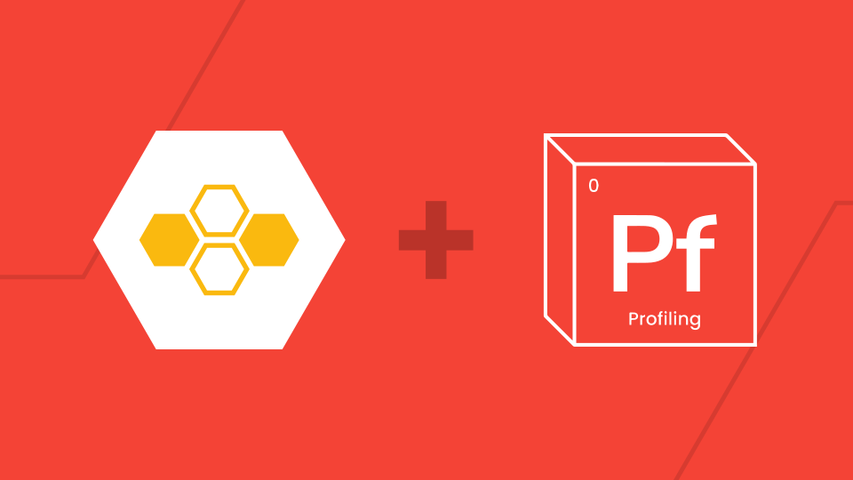
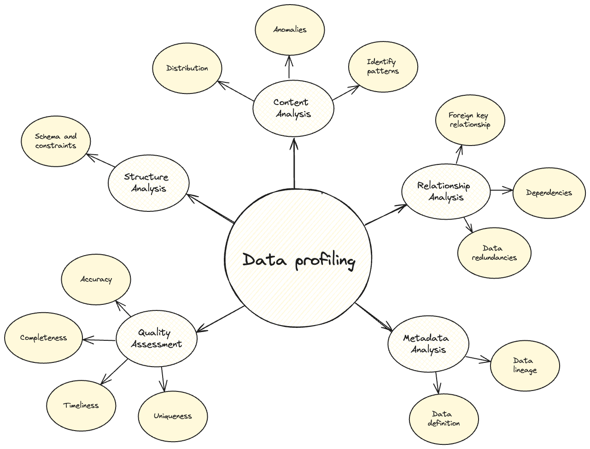
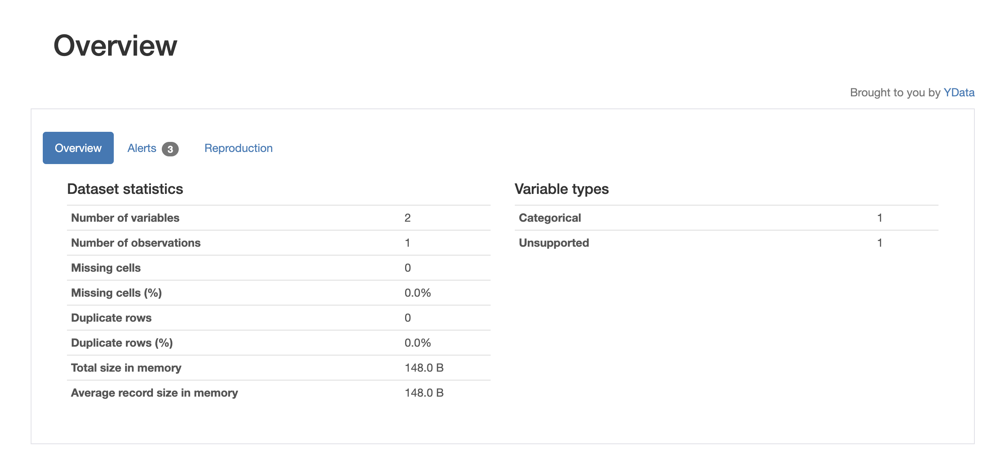
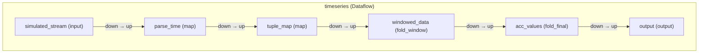

# Profiling Streaming Time Series Data




In this guide, we will show you how you can combine [Bytewax](https://bytewax.io/) with [ydata-profiling](https://github.com/ydataai/ydata-profiling) to profile and understand the quality of your streaming data!


| Skill Level | Time to Complete | Level |
| ----------- | ---------------- | ----- |
| Intermediate Python programming, understanding of windowing | Approx. 15-30  Min | Intermediate |


## Your Takeaway

You'll be able to handle and structure data streams into snapshots using Bytewax, and then analyze them with ydata-profiling to create a comprehensive report of data characteristics for each device at each time interval.

## Resources

<gh-path:/docs/tutorials/profiling-time-series-data/timeseries_dataflow.py>

## What is data profiling?


Data profiling is the process of examining and analyzing data from an existing data source, such as a database or a data file, to collect statistics and information about the data's structure, content, and quality. The main objectives of data profiling include understanding data patterns, discovering inconsistencies, identifying outliers, and assessing the overall quality of the data. This process is crucial for data management, data integration, and ensuring the data meets the required standards for business intelligence and analytics.




Key activities involved in data profiling include:

* **Structure analysis**: which examines the data schema, including tables, columns, data types, and constraints to ensure a well-defined and consistent structure.
* **Content analysis** assesses actual data values to identify patterns, distributions, and anomalies, including missing values, duplicate records, and incorrect or invalid entries.
* **Relationship analysis** investigates the relationships between different data elements, such as foreign key relationships, dependencies, and redundancies.0
* **Metadata analysis** reviews metadata to understand the context and meaning of the data elements, including definitions, source, and lineage. Quality Assessment measures the data's quality based on criteria like accuracy, completeness, consistency, timeliness, and uniqueness.
* **Quality Assessment**: Measuring the quality of the data based on criteria like accuracy, completeness, consistency, timeliness, and uniqueness.

Data profiling tools and techniques can automate these processes, providing visualizations and reports to help data analysts and data scientists make informed decisions about data management and utilization.

## Why incorporate data profiling in streaming time series data?

Data profiling is critically important in real-time series data processing for several reasons:

1. **Data quality assurance**: Real-time series data, such as sensor data, stock market prices, or log files, need to be accurate and reliable. Data profiling helps identify and correct anomalies, missing values, and errors in real-time, ensuring the quality of the data before it is used for analysis or decision-making.

2. **Understanding data patterns**: Profiling helps in understanding the patterns and trends within real-time data streams. This understanding is crucial for building accurate predictive models, anomaly detection systems, and for making informed business decisions based on real-time insights.

3. **Efficient data integration**: In real-time processing, data often comes from multiple sources. Profiling ensures that the data from these sources is consistent and correctly formatted, facilitating smooth integration and reducing the chances of errors during data merging and analysis.

4. **Anomaly detection**: Real-time data often needs to be monitored for unusual patterns or outliers that could indicate issues like fraud, equipment failure, or security breaches. Data profiling establishes baseline patterns and thresholds, making it easier to detect and respond to anomalies in real-time.

5. **Informed decision-making**: High-quality, well-profiled real-time data provides accurate and timely insights, enabling businesses to make better decisions quickly. For example, in the context of stock trading, accurate real-time data can lead to more profitable trades.

6. **Data governance and compliance**: Real-time data profiling ensures that data governance policies are adhered to by continuously monitoring data quality and compliance with regulatory requirements. This is particularly important in industries such as finance and healthcare, where data integrity and compliance are critical.

Let's get started!

## Set up and imports

Before we begin, let's import the necessary modules and set up the environment for building the dataflow.

Complete installation - we recommend using a virtual environment to manage your Python dependencies. You can install Bytewax using pip:

```{code-block} console
:substitutions:
$ python -m venv venv
$ ./venv/bin/activate
(venv) $ pip install bytewax==|version|
(venv) $ pip install ydata-profiling==4.9.0
(venv) $ pip install pandas==2.2.2 pandas-stubs
```

Now, let's import the required modules and set up the environment for building the dataflow.

First, let’s make some necessary imports

```{literalinclude} timeseries_dataflow.py
:caption: dataflow.py
:language: python
:start-after: start-imports
:end-before: end-imports
:lineno-match:
```

To simulate a stream of data, we will use the Bytewax {py:obj}`~bytewax.connectors.files.CSVSource` connector to read the CSV file we downloaded one line at a time. In a production use case, you could easily swap this out with the [{py:obj}`~bytewax.connectors.kafka` connector](https://docs.bytewax.io/stable/api/bytewax/bytewax.connectors.kafka.html).

## Downloading the data

Let's download a subset of the [Environmental Sensor Telemetry Dataset](https://www.kaggle.com/datasets/garystafford/environmental-sensor-data-132k) (License — CC0: Public Domain), which contains several measurements of temperature, humidity, carbon monoxide liquid petroleum gas, smoke, light, and motion from different IoT devices.

In a production environment, these measurements would be continuously generated by each device, and the input would look like what we expect in a streaming platform such as [Kafka](https://bytewax.io/guides/enriching-streaming-data).

```console
wget https://raw.githubusercontent.com/bytewax/air-quality-sensor/main/data/iot_telemetry_data_1000 > iot_telemetry_data_1000.csv
```

The command above will pipe the downloaded data into a csv file called `iot_telemetry_data_1000.csv`. We can then initialize the dataflow and make that file our input source.

## Initialize the dataflow

The code below will initialize a Bytewax dataflow called `timeseries`, we can initialize our input in the dataflow as follows:

```{literalinclude} timeseries_dataflow.py
:caption: dataflow.py
:language: python
:start-after: start-dataflow
:end-before: end-dataflow
:lineno-match:
```

Once we have initialized the dataflow, let's perform some data wrangling.

```{literalinclude} timeseries_dataflow.py
:caption: dataflow.py
:language: python
:start-after: start-parse-time-stamp
:end-before: end-parse-time-stamp
:lineno-match:
```

The code performs the following tasks:

* Parse Timestamps: Converts Unix timestamps in the `input_data` to UTC datetime objects using the `parse_time` function.
* Map to Tuples: Transforms the parsed data into tuples where each tuple consists of a device identifier and the corresponding reading data. This leverages the Bytewax {py:obj}`~bytewax.operators.map` operator and applies it onto each line of the csv file.

This process ensures that timestamps are uniformly formatted and organizes the data by device, preparing it for further analysis or processing steps.

We will now turn our attention to windowing for further processing.

## Windowing in Real-Time Series Processing

Windowing is a technique used in real-time series processing to divide continuous streams of data into finite chunks or "windows" for easier and more manageable analysis. This approach is crucial because it allows for real-time analytics on data streams by breaking down the data into manageable intervals. It helps in performing operations like aggregation, averaging, and detecting patterns within these windows.

### Importance of Windowing

The following are key areas where windowing comes in handy.

1. **Manageability**: By breaking down a continuous stream into windows, data becomes easier to handle and analyze.
2. **Real-Time Analysis**: Enables real-time insights by performing computations on the most recent data within each window.
3. **Resource Efficiency**: Reduces the computational and memory load by processing smaller data segments rather than the entire stream.
4. **Pattern Detection**: Facilitates the detection of trends and patterns within specific time frames, which is crucial for applications like anomaly detection and forecasting.

**Our goal is to accumulate and merge data within specified time windows.** We will work with a **tumbling window**, which processes data in fixed one-hour intervals, starting from a specific alignment time. Data is accumulated within these windows, enabling efficient and timely analysis of the data stream.

We will create helper functions to accumulate and merge the data:

```{literalinclude} timeseries_dataflow.py
:caption: dataflow.py
:language: python
:start-after: start-accumulator-helpers
:end-before: end-accumulator-helpers
:lineno-match:
```

We can then initialize windowing configuration using the Bytewax {py:obj}`~bytewax.operators.windowing.EventClock` to configure the event time, and {py:obj}`~bytewax.operators.windowing.TumblingWindower` to configure the window

```{literalinclude} timeseries_dataflow.py
:caption: dataflow.py
:language: python
:start-after: start-windowing
:end-before: end-windowing
:lineno-match:
```

We can then apply the helper functions we created and combine it with the configured windowing using {py:obj}`~bytewax.operators.windowing.fold_window` as follows. In the code below we use the alias `wop` for {py:obj}`~bytewax.operators.windowing`:

```{literalinclude} timeseries_dataflow.py
:caption: dataflow.py
:language: python
:start-after: start-windowed-data
:end-before: end-windowed-data
:lineno-match:
```

With this, we are now ready to create a profile of the data.

## Generating a Profile report

We will define a process to generate profiling reports for accumulated data within time windows. Our goals are:

* **Accumulate data**: Collect readings within each window.
* **Generate profiling reports**: For each window of accumulated data, create a profiling report using the pandas-profiling library.
* **Save reports**: Save the profiling reports as HTML files with filenames that include the current UTC timestamp.

Here we leverage the `ProfileReport` class from the `ydata_profiling` package

```{literalinclude} timeseries_dataflow.py
:caption: dataflow.py
:language: python
:start-after: start-profile-report
:end-before: end-profile-report
:lineno-match:
```

The windowing mechanism groups data into manageable chunks based on time intervals using the {py:obj}`~bytewax.operators.fold_final` operator. This code works on the windowed data:

1. Accumulate Readings: It collects the readings into accumulators for each time window.
2. Generate Reports: It generates and saves a profiling report for each window of accumulated readings, providing insights into the data's structure, content, and quality for that specific time period.

By integrating profiling into the windowed data processing pipeline, this approach ensures continuous monitoring and assessment of data quality and characteristics over time, facilitating real-time data analysis and decision-making.

## Returning results

We can then direct the results of our dataflow into a sink. For simplicity, we will use {py:obj}`~bytewax.connectors.stdio.StdOutSink` sink.

```{literalinclude} timeseries_dataflow.py
:caption: dataflow.py
:language: python
:start-after: start-output
:end-before: end-output
:lineno-match:
```

## Executing the dataflow

And we are ready to run our program! You can run it on your machine with the following command.

```console
python -m bytewax.run timeseries_dataflow:flow
```

This will generate a series of `html` files with a profile of the data.

Here is what the profiling report would look like for the data:



## Generating a mermaid graph

We can also visualize the steps in the dataflow as follows:

```console
python -m bytewax.visualize timeseries_dataflow:flow
```

This yields:



## Summary

We can now use the profiling reports to validate the data quality, check for changes in schemas or data formats, and compare the data characteristics between different devices or time windows.

Being able to process and profile incoming data appropriately opens up a plethora of use cases across different domains, from the correction of errors in data schemas and formats to the highlighting and mitigation of additional issues that derive from real-world activities, such as anomaly detection (e.g., fraud or intrusion/threats detection), equipment malfunction, and other events that deviate from the expectations (e.g., data drifts or misalignment with business rules).

This guide was written with the support of the Ydata team.
