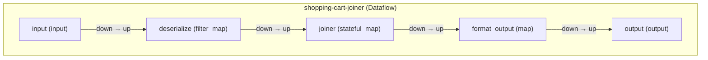

# Recoverable Streaming Shopping Cart Application


In this example, we're going to build a small online order fulfillment system. It will join two events within a stream: one event type containing customer orders and another containing successful payments. The dataflow will emit completed orders for each customer that have been paid. It will also handle a failure event without crashing.

| Skill Level | Time to Complete | Level |
| ----------- | ---------------- | ----- |
| Intermediate Python programming, building data classes | Approx. 15 Min | Intermediate |


## Your Takeaway

This tutorial will show you how to build a recoverable streaming application that aggregates shoppers data into a shopping cart that is recoverable in the instance that it fails.

## Resources

<gh-path:/docs/tutorials/recoverable-shopping-cart/recoverable_dataflow.py>

## Introduction and problem statement

A recoverable system is designed to quickly and effectively restore functionality after experiencing a failure or disruption. Building recoverable systems is crucial for several reasons:

1. **Minimizing Downtime**: Recoverable systems can quickly return to operation after a failure, minimizing downtime and maintaining service availability. This is vital for businesses where downtime can result in significant financial losses and damage to reputation.

2. **Data Integrity and Safety**: Recoverable systems ensure that data is not lost or corrupted during failures. This is essential for maintaining the integrity and safety of critical data, which can be particularly important in industries like finance, healthcare, and telecommunications.

3. **Improved User Experience**: Users expect systems to be reliable. When failures occur, a system that can recover quickly and effectively helps maintain a positive user experience and trust in the service or product.

4. **Cost Efficiency**: The ability to recover from failures efficiently can save costs associated with prolonged outages, such as emergency repairs, lost productivity, and customer compensation.

5. **Regulatory Compliance**: Many industries are subject to regulatory requirements that mandate robust data protection and continuity measures. Recoverable systems help organizations comply with these regulations.

6. **Business Continuity**: For many businesses, continuity is critical. Recoverable systems ensure that operations can continue with minimal interruption, protecting the business from catastrophic failures.

7. **Resilience Against Cyber Threats**: With the increasing prevalence of cyber-attacks, having systems that can recover quickly from breaches or ransomware attacks is vital to protect sensitive data and maintain business operations.

8. **Competitive Advantage**: Companies that can guarantee high availability and reliability gain a competitive edge in the market. Customers and clients prefer to engage with businesses that can ensure continuous service.

9. **Customer Trust and Satisfaction**: Reliable and recoverable systems build customer trust. When customers know that a service is dependable even in the face of issues, they are more likely to remain loyal and recommend the service to others.

10. **Future-Proofing**: As technology and business environments evolve, having recoverable systems ensures that an organization can adapt and respond to new challenges and opportunities without major disruptions.

Building recoverable systems is a strategic imperative that ensures operational continuity, protects data integrity, enhances user satisfaction, and provides a competitive edge in the marketplace. In this guide, we will implement a simple example of a recoverable system for a streaming dataflow. Let's get started!

## Pre-requisites

Sample Data

Make a file named `cart-join.json` with the following data:

```console
{"user_id": "a", "type": "order", "order_id": 1}
{"user_id": "a", "type": "order", "order_id": 2}
{"user_id": "b", "type": "order", "order_id": 3}
{"user_id": "a", "type": "payment", "order_id": 2}
{"user_id": "b", "type": "order", "order_id": 4}
FAIL HERE
{"user_id": "a", "type": "payment", "order_id": 1}
{"user_id": "b", "type": "payment", "order_id": 4}
```

The purpose of this dataset is to simulate a situation in which the `FAIL HERE` can be handled and the dataflow can continue despite it.

## Imports and Setup

Before we begin, let's import the necessary modules and set up the environment for building the dataflow.

Complete installation - we recommend using a virtual environment to manage your Python dependencies. You can install Bytewax using pip:

```{code-block} console
:substitutions:
$ python -m venv venv
$ ./venv/bin/activate
(venv) $ pip install bytewax==|version|
```

Now, let's import the required modules and set up the environment for building the dataflow.

```{literalinclude} recoverable_dataflow.py
:caption: dataflow.py
:language: python
:start-after: start-imports
:end-before: end-imports
:lineno-match:
```

Let's now turn towards initializing the dataflow.

## Creating our Dataflow

We can initialize our dataflow as follows. To add our fake data source as input, we will use the {py:obj}`~bytewax.connectors.files.FileSource` connector - this will enable us to read from a local file. For productionized environments reading from a source such as Kafka, we can swap this for the {py:obj}`~bytewax.connectors.kafka` connector instead.

We can use the Bytewax {py:obj}`~bytewax.operators` through the alias `op` and connect the input source through the {py:obj}`~bytewax.operators.input` operator:

```{literalinclude} recoverable_dataflow.py
:language: python
:start-after: start-dataflow
:end-before: end-dataflow
:lineno-match:
```

The code above enables us to process our data using streaming. We will now turn our attention towards data deserialization.

## Deserializing the data

Data deserialization is essential in streaming applications as it converts serialized or binary data into usable structures, enabling real-time processing and analysis. It ensures compatibility across different system components and data formats, promotes efficiency by transforming compact data for manipulation, and maintains accurate state management. Deserialization also includes validation and error handling to preserve data integrity and reliability. Additionally, it supports scalability by handling high-throughput data streams and facilitates integration with various data sources and sinks, making it a crucial process for the effective functioning of streaming applications.

Let's take a look at a simple way we can perform this step as part of our dataflow:


```{literalinclude} recoverable_dataflow.py
:language: python
:start-after: start-deserialize
:end-before: end-deserialize
:lineno-match:
```

In the code above, the `safe_deserialize` function loads the `json` file and checks whether certain fields are in it (`user_id`, `type` and `order_id`). If so, we can then return a tuple and otherwise we will return `None`. We can then use the Bytewax {py:obj}`~bytewax.operators.filter_map` operator - this will enable us to apply the `safe_deserialize` function and handle the `None` case scenario.

Once the data has been deserialized, we can now turn our attention towards the orders made by each user, and whether or not they were paid for. To handle this in a streaming scenario, one key concept is **state management**. Let's take a closer look at this.

## Why state management is important in a streaming application?

**State management** is the process of maintaining and updating the current state of an application, ensuring it accurately reflects all relevant events and changes over time. This involves tracking and storing the state data, handling real-time updates, and ensuring consistency, accuracy, and reliability.

State management is crucial in streaming applications for several reasons.

- **Consistency and Accuracy**: Maintains a reliable representation of the current state, reflecting all relevant events and changes.
- **Real-Time Processing**: Enhances capabilities by allowing the system to process and react to incoming data promptly.
- **Event Correlation**: Supports tracking the sequence of events and their interdependencies, enabling complex processing logic.
- **Resilience and Recovery**: Ensures systems can restore the state from a consistent point after failures, maintaining continuity and reliability.
- **Efficiency**: Avoids redundant processing and re-computation by incrementally updating the state.
- **User Experience**: Guarantees users receive the most up-to-date and accurate information, enhancing their experience and trust in the system.

For user-facing applications like e-commerce or real-time analytics, state management guarantees that users receive the most up-to-date and accurate information, thereby enhancing their experience and trust in the system. Let's now take a look at how we can implement this in our dataflow.

## Implementing state management into our dataflow

We will create a couple helper functions and classes to faciliate this, and combine it along with Bytewax operators.

```{literalinclude} recoverable_dataflow.py
:language: python
:start-after: start-state-class
:end-before: end-state-class
:lineno-match:
```

We define the `ShoppingCartState` class. This class maintains the state of a shopping cart, tracking unpaid and paid orders. We also define a function `state_manager` - this function manages the state of the shopping cart, initializing it, then updating it with new events and summarizing the current state.

```{literalinclude} recoverable_dataflow.py
:language: python
:start-after: start-map-manager
:end-before: end-map-manager
:lineno-match:
```

We can then use the Bytewax {py:obj}`~bytewax.operators.stateful_map` operator. We will apply this as a stateful map operation named "joiner" that processes the deserialized data and manages the state for each user. We can then apply the Bytewax {py:obj}`~bytewax.operators.map` operator. This formats the output data for display or further processing.

The `joined_data` line uses a stateful map operation to process deserialized data and manage the state for each user, producing updated states and their summaries. The formatted_output line then formats these summaries into readable strings, resulting in a stream of messages like `"Final summary for user {user_id}: {summary}"`.

We are now ready to return results.

## Output

To return results, we will redirect them to a Bytewax sink, for simplicity we will use {py:obj}`~bytewax.connectors.stdio.StdOutSink` but this can be replaced with a different Bytewax {py:obj}`~bytewax.connectors` of your choice.

```{literalinclude} recoverable_dataflow.py
:language: python
:start-after: start-output
:end-before: end-output
:lineno-match:
```

## Executing the dataflow

We can execute the dataflow as follows:

```console
python -m bytewax.run recoverable_dataflow:flow
```

This yields:

```console
Skipping invalid data: FAIL HERE
Final summary for user a: {'paid_order_ids': [], 'unpaid_order_ids': [1]}
Final summary for user a: {'paid_order_ids': [], 'unpaid_order_ids': [1, 2]}
Final summary for user a: {'paid_order_ids': [2], 'unpaid_order_ids': [1]}
Final summary for user a: {'paid_order_ids': [2, 1], 'unpaid_order_ids': []}
Final summary for user b: {'paid_order_ids': [], 'unpaid_order_ids': [3]}
Final summary for user b: {'paid_order_ids': [], 'unpaid_order_ids': [3, 4]}
Final summary for user b: {'paid_order_ids': [4], 'unpaid_order_ids': [3]}
```

We can see the `FAIL HERE` entry was promptly identified and skipped and the state of the order was tracked.

## Visualizing the dataflow

We can also visualize the dataflow as a mermaid graph through the commend

```console
python -m bytewax.visualize recoverable_dataflow:flow
```



## Summary

Recoverable dataflows are key to any production system. This tutorial demonstrated how you can do this through building a shopping cart application.
