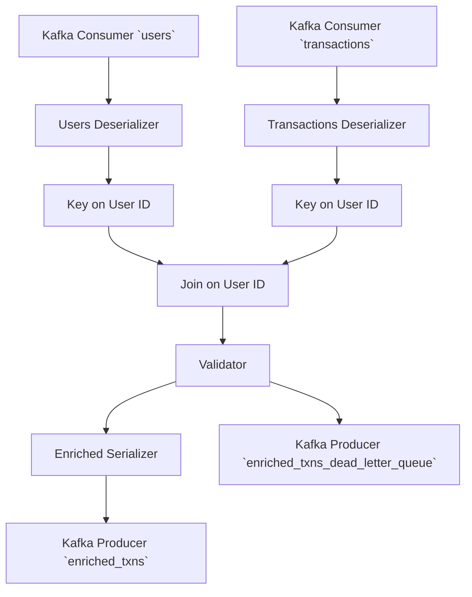

# Writing API Documentation

API documentation is Markdown files in the `/apidocs` folder. It is
built using [Sphinx](https://www.sphinx-doc.org/en/master/) and
[MyST](https://myst-parser.readthedocs.io/en/latest/index.html) for
Markdown parsing.

## MyST Cheat Sheet

Here's a quick rundown of common things in MyST flavored Markdown.

### Docstrings

Docstrings can be written using the all the features of MyST. Some
docstring-specific hints will be provided here.

#### Arguments

Docstrings should use MyST Markdown as the text body. Arguments,
return values, etc. specified using [MyST field
lists](inv:myst#syntax/fieldlists) which are `:name value:
Description` lines. The field names should be the same as the
[Sphinx](inv:sphinx#info-field-lists).

```python
def my_func(x: int, y: str) -> str:
    """Do the cool thing.

    :arg x: Describe the X parameter.

    :arg y: Describe the Y parameter. If this is a really long line,
        you can wrap it with indentation. You can also use any
        **syntax** here you like.

    :returns: A description of the return value.

    """
    ...
```

If the function signature is coming from PyO3 (and thus there are no
type hints in the code) you can use the `:type var:` and `:rtype:`
fields to provide argument and return value type hints.

```rust
/// Do the cool thing.
///
/// :arg x: Describe the X parameter.
///
/// :type x: int
///
/// :arg y: Describe the Y parameter. If this is a really long line,
///     you can wrap it with indentation. You can also use any
///     **syntax** here you like.
///
/// :type y: str
///
/// :returns: A description of the return value.
///
/// :rtype: str
#[pyfunction]
fn my_func(x: usize, y: String) -> String {
    todo!();
}
```

#### Class and Module Variables

You can add "post-variable docstrings" to document these.

```python
from dataclasses import dataclass
from typing import TypeVar


X = TypeVar("X")
"""Type of a cool thing."""


@dataclass
class Container:
    x: int
    """This is the docstring for this attribute."""

    y: str
    """This is the docstring for this other attribute."""
```

### Cross References

See [MyST's documentation on cross
referencing](inv:myst#syntax/cross-referencing) for all the ways this
can work. I'll give a quick summary here.

#### API Docs

To link to a symbol in the Bytewax library, use the full dotted path
to it surrounded by `` ` `` and proceeded by `{py:obj}`.

```markdown
This operator returns a {py:obj}`bytewax.dataflow.Stream`.
```

Appears as:

> This operator returns a {py:obj}`bytewax.dataflow.Stream`.

You should always use the full dotted path to reference a name, but if
you don't want it to appear as a full dotted path because of the
context of the surrounding text, prefix the path with `~`.

```markdown
This operator returns a {py:obj}`~bytewax.dataflow.Stream`.
```

Appears as:

> This operator returns a {py:obj}`~bytewax.dataflow.Stream`.

### Example Code

Use backtick code blocks with the `python` language type.

````markdown
```python
flow = Dataflow()
```
````

### Shell Sessions

Use the language type `console` (instead of `bash`), and start
commands you run with `$` to get proper highlighting.

````markdown
```console
$ waxctl list
output here
```
````

Appears as:

> ```console
> $ waxctl list
> output here
> ```

### Mermaid Diagrams

We have install the Sphinx
[`sphinxcontrib-mermaid`](https://sphinxcontrib-mermaid-demo.readthedocs.io/en/latest/)
plugin which allows you to use `mermaid` as a code block language
name.

````markdown

````

Appears as:


## Build Process

API reference documentation is automatically during the Sphinx build
process via the [`sphinx-autodoc2`
extension](https://sphinx-autodoc2.readthedocs.io/en/latest/index.html)
generated from our Python source in `/pysrc`. The build process turns
the source into automatically generated Markdown files in
`/apidocs/api`, which are then passed through the Sphinx builder.

The built HTML files are put in `/apidocs/html`. This is what should
be served.

### Pipenv

I have setup [`pipenv`](https://pipenv.pypa.io/en/latest/) as the way
to manage the blessed environment for building documentation because
it supports creating reproducible environments. It lets you pin a
specific version of the Python interpreter and all packages. These are
saved via `/apidocs/Pipfile` and `/apidocs/Pipfile.lock`.

You should install the latest version of `pipenv` globally and it will
use the lockfile in the current directory. It won't affect any other
Python environment tooling.

```console
$ pip install pipenv
```

`pipenv` will automatically use
[`pyenv`](https://github.com/pyenv/pyenv) to install the correct
version of the Python interpreter to make things consistent.

You should use the two build scripts below which automatically setup
`pipenv` for you.

### Auto Builder

The quickest way to iterate on your docs is to run the
`./autobuild.sh` script from the `/apidocs` directory.

```console
$ cd apidocs
$ ./autobuild.sh
Creating a virtualenv for this project...
...
All dependencies are now up-to-date!
...
Running Sphinx v7.2.6
...
[I 240124 12:03:11 server:335] Serving on http://127.0.0.1:8000
```

This starts a web server on <http://localhost:8000/> with the built
docs and will watch the source files and rebuild on any change.

### Committing Changes

Before a release, the updated docs should be committed into the repo.
Use the `./build.sh` script run from the `/apidocs` directory.

```console
$ cd apidocs
$ ./build.sh
```

Then commit the updated `/apidocs/html` directory.

```console
$ git add html
$ git commit
```
